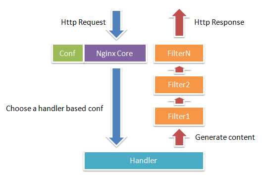

# 切图仔的 Nginx 小书

> 本文陆续介绍 Nginx 的功能、配置、及一些实用场景（待完善...）。

## 一、介绍 Nginx

#### 1. Nginx 是什么？

Nginx，很多工程师喜欢读成'恩基克思'。Nginx 是一款高性能的HTTP和反向代理服务器软件，第一个开源版本诞生于2004年,虽然诞生较晚但经过十多年的发展,已经成为非常流行的 web 服务器软件。其发展速度和流行程度已经远远超过其它同类软件,成为大型网站和高并发网站的首选。

#### 2. Nginx 为什么流行

Nginx 之所以能够脱颖而出，一方面是因为市场往往会选择简单实用的技术,另一方面是因为web服务器的高并发已经成为趋势,而高并发又要求架构具有健壮性和可伸缩性。Nginx 的特性迎合了市场的这个发展趋势,它是为性能而生,从发布以来一直侧重于高性能,高并发,低 CPU 内存消耗;在功能方面:负载均衡,反向代理,访问控制,热部署,高扩展性等特性又十分适合现代的网络架构。更可贵的是配置简单文档丰富,大大降低了学习的门槛。这样稳定,性能强,功能丰富又简单的产品当然会受欢迎了。

#### 3. 为什么选择 Nginx？

Apache 自1990年发布以来，一直是 web 服务器市场的霸主。Nginx 虽然发布较晚，但是却因为在高并发下卓越的表现而迅速崭露头角。最初，Nginx 只是作为 Apache 在高并发场景下的补充，两者结合辅助使用。而现在，Nginx 随着迭代功能，在极多数场合已经可以抛弃老大哥来独当一面了。


Nginx 和 Apache 相同点：

- 同是 Http 服务器软件，都采用模块化结构设计
- 支持通用语言接口，如 PHP，Python 等。
- 支持正向代理和反向代理。
- 支持虚拟主机以及 SSL 加密传输
- 支持缓存以及压缩传输
- 支持 URL 重写
- 模块多，扩展性强
- 多平台支持

Nginx 的优势：

- 轻量级，安装简单、配置文件简洁，运行时 CPU 内存使用率低。
- 性能强 支持多核，处理静态文件效率高。
- 支持热部署，启动速度快，可以在不间断服务情况下对软件和配置进行升级
- 负载均衡 支持容错和健康检查
- 代理功能强大 支持无缓存的方向代理，同时支持 IMAP/POPS/SMTP 的代理

Nginx 的劣势：

- 相对于老大哥 Apache 模块要少一些
- 对动态请求的支持不如 Apache
- Windows 版本功能有限，受限于 Windows 的特性，支持最好的还是 *unix 系统

#### 4. Nginx 的工作原理

Nginx 由内核和一系列模块组成，内核提供 Web Server 的基本功能，如启动网络协议，创建运行环境，接收和分配客户端请求，处理模块之间的交互。Nginx 的各种功能和操作都由模块来实现。  
Nignx 的模块从结构上分为：

- 核心模块：HTTP 模块、EVENT 模块和 MAIL 模块
- 基础模块：HTTP Access 模块、HTTP FastCGI 模块、HTTP Proxy 模块和 HTTP Rewrite 模块
- 第三方模块：HTTP Upstream Request Hash 模块、Notice 模块和HTTP Access Key 模块以及其它自开发模块。

这样的设计使 Nginx 方便开发和扩展，也正因此才使得 Nginx 功能如此强大。Nginx 的模块默认编译进 Nginx 中，如果需要增加或删除模块，需要重新编译 Nginx ，这一点不如 Apache 的动态模块加载方便。（如果需动态加载模块，可以使用兼容 Nginx 的web服务器 Tengine ）


#### 5. Nginx 的请求处理

Nginx 使用一个多进程模型来应对外来需求，其中一个 master 进程，多个 worker 进程。master 进程负责管理 Nginx 本身和其他 worker 进程。

所有实际上的业务处理逻辑都在 worker 进程，其内有一个无限循环执行的函数，不断处理来自客户端的请求，并进行处理，直到整个 Nginx 服务停止。

worker 进程中，ngx_worker_process_cycle() 就是这个无线循环的函数。内部对一个请求的简单处理流程如下：

1. 操作系统提供的机制产生相关的事件
2. 接受和处理这些事件，如果是接收数据，则产生更高层的request对象
3. 处理 request 的 header 和 body
4. 产生响应，并发送回客户端
5. 完成 request 的处理
6. 重新初始化定时器及其他事件

如图展示了 Nginx 模块常规的HTTP请求和响应的过程:
 


## 二、Nginx 配置

```
#运行用户
user nobody;
#启动进程,通常设置成和cpu的数量相等
worker_processes  1;
 
#全局错误日志及PID文件
#error_log  logs/error.log;
#error_log  logs/error.log  notice;
#error_log  logs/error.log  info;
 
#pid        logs/nginx.pid;
 
#工作模式及连接数上限
events {
    #单个后台worker process进程的最大并发链接数    
    worker_connections  1024;
}
 
 
http {
    #设定mime类型,类型由mime.type文件定义
    include    mime.types;
    default_type  application/octet-stream;
    #设定日志格式
    log_format  main  '$remote_addr - $remote_user [$time_local] "$request" '
                      '$status $body_bytes_sent "$http_referer" '
                      '"$http_user_agent" "$http_x_forwarded_for"';
 
    access_log  logs/access.log  main;
 
    #sendfile 指令指定 nginx 是否调用 sendfile 函数（zero copy 方式）来输出文件，
    #对于普通应用，必须设为 on,
    #如果用来进行下载等应用磁盘IO重负载应用，可设置为 off，
    #以平衡磁盘与网络I/O处理速度，降低系统的uptime.
    sendfile     on;
    #tcp_nopush     on;
 
    #连接超时时间
    #keepalive_timeout  0;
    keepalive_timeout  65;
    
    #开启gzip压缩
    #gzip  off;
 
    #设定虚拟主机配置
    server {
        #侦听80端口
        listen    80;
        #定义使用 www.nginx.cn访问
        server_name  www.nginx.cn;
 
        #定义服务器的默认网站根目录位置
        root html;
 
        #设定本虚拟主机的访问日志
        access_log  logs/nginx.access.log  main;
 
        #默认请求
        location / {
            
            #定义首页索引文件的名称
            index index.php index.html index.htm;   
 
        }
 
        # 定义错误提示页面
        error_page   500 502 503 504 /50x.html;
        location = /50x.html {
        }
 
        #静态文件，nginx自己处理
        location ~ ^/(images|javascript|js|css|flash|media|static)/ {
            
            #过期30天，静态文件不怎么更新，过期可以设大一点，
            #如果频繁更新，则可以设置得小一点。
            expires 30d;
        }
 
        #PHP 脚本请求全部转发到 FastCGI处理. 使用FastCGI默认配置.
        location ~ .php$ {
            fastcgi_pass 127.0.0.1:9000;
            fastcgi_index index.php;
            fastcgi_param  SCRIPT_FILENAME  $document_root$fastcgi_script_name;
            include fastcgi_params;
        }
 
        #禁止访问 .htxxx 文件
            location ~ /.ht {
            deny all;
        }
 
    }
}
```

## 三、Nginx 命令行

不像其他系统软件，Nginx 仅由几个命令行参数
```
-c </path/to/config> // 为Nginx指定一个配置文件，来代替缺省的
-t // 不运行，仅仅测试配置。
-v // 显示Nginx的版本
-V // 显示Nginx的版本，编译器版本和配置参数。
```

Nginx 启动、停止、重启命令

```
// 启动
sudo nginx
// 或者
sudo /usr/local/Cellar/nginx/1.12.0_1/bin/nginx // 如果不知道实际路径，可以nginx —V查看

// 停止命令
ps -ef | grep nginx // 查看占用进程
kill -QUIT nginx主进程号 // 从容停止
kill -TERM nginx主进程号 // 快速停止
kill -9 nginx主进程号 // 强制停止
// 或者
kill -QUIT `cat /usr/local/var/run/nginx.pid` // 如果不知道实际路径，可以nginx —V查看
// 重启命令
kill -QUIT `cat /usr/local/var/run/nginx.pid`
sudo /usr/local/Cellar/nginx/1.12.0_1/bin/nginx
```

## 四、Nginx 实用

#### 场景1：适配PC与移动web

一般门户网站在访问时，会有 PC 和 H5、Pad 几个适配版本，我们常会有这样的需求，在网站被访问时候，服务端来识别用户是 PC 设备还是移动设备，跳转返回相应适配版本的页面。

第一步通常是判断 HTTP 请求头的 User-Agent ，基本原理是通过正则匹配判断，有一套开源的解决方案可以直接使用：[http://detectmobilebrowsers.com/](http://detectmobilebrowsers.com/)，下载 Nginx 配置即可。  
第二步就是通过之前对设备的判断，来反向代理到不同的版本。

```
location / {
	proxy_pass http://leju.com
	if ($mobile_rewrite = perform) {  
        proxy_pass http://m.leju.com/  # 手机版  
    } 	
}
```
第三步，因为可能错误判断设备，或者用户就想指定访问某种设备版本，在页面底部，通常会有链接跳转其他版本。


```
<div class="ll_btn">
			<a href="http://www.leju.com#ln=index_fdh">电脑版</a>
			<a href="http://pad.leju.com/?source=chuping#ln=index_fdh">PAD版</a>
			<a href="http://m.leju.com/touch/app/app_download.html?source=chupinghp#ln=index_fdh">客户端</a>
</div>
```
同时在 Nginx 中加入判断，如果包含指定 source 参数，则指定进入某个版本。

#### 场景2：前端环境切换

前端开发中，我们经常需要在多个环境（开发、内测、外测、预发、正式环境）进行切换。  
我们通常通过切换 host 指向搭配机器绑定不同域名的方式去实现：比如测试环境是`dev.j.esf.sina.com`，正式环境是`j.esf.sina.com`,搭配不同的 host 指向，可以形成多种组合。

而通过反向代理的Nginx，更容易处理这种代理转发的问题：

- 我们通过点击页面的环境按钮，让绑定的 javascript 代码往域名下种入带有 IP 信息的 cookie，同时刷新页面。
- Nginx 接收新的请求，读取请求的 cookie ，如果包含指定的键名和值，则代理到这个 IP 地址。（http header 也可以）
- 如果没有，则代理到默认的线上环境。

```
set $env_id “123.59.190.206”;
if( $http_cookie~* "host_id(\S+)(;.*|$)"){
	set $env_id $1;
}

location / {
	proxy_set_header Host $host;
	proxy_pass   http://$env_id:80;
}
```

...场景待续


