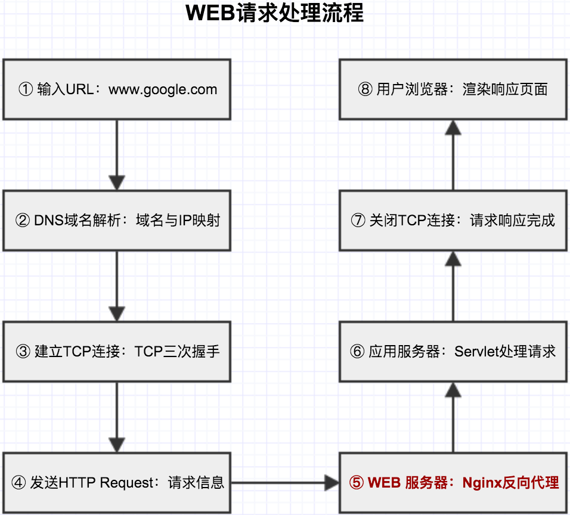

## WEB请求处理 笔记2:Nginx请求反向代理



Nginx功能是进行请求的反向代理，在Nginx请求处理之前，首先要清楚地说明下反向代理是什么？他的功能是什么？

#### 1 反向代理

1.概念

反向代理（Reverse Proxy）方式是指代理服务器来接受internet上的连接请求，然后将请求转发给内部网络上的服务器，并将从服务器上得到的结果返回给internet上请求连接的客户端，此时代理服务器对外就表现为一个服务器。

> 反向代理服务器对于客户端而言它就像是原始服务器，并且客户端不需要进行任何特别的设置。

####（抛出一个问题：有反向代理，就肯定有正向代理。什么叫正向代理呢？）

正向代理（Forward Proxy）通常都被简称为代理，就是在用户无法正常访问外部资源，比方说受到防火墙的影响无法访问的时候，我们可以通过代理的方式，让用户绕过防火墙，从而连接到目标网络或者服务。

正向代理的工作原理就像一个跳板，是一个位于客户端和原始服务器（origin server）之间的服务器。

2.工作流程

```
1. 用户通过域名访问Web服务器的请求，该域名被DNS服务器解析为反向代理服务器的IP地址；
2. 反向代理服务器接收用户的请求。
3. 反向代理服务器在本地缓存中查找请求的内容，找到后直接把内容发送给用户；
4. 如果本地缓存里没有用户所请求的信息内容，反向代理服务器会代替用户向源服务器请求同样的信息内容，并把信息内容发给用户，如果信息内容是可缓存的，还会把它保存到缓存中
```

3.优点


