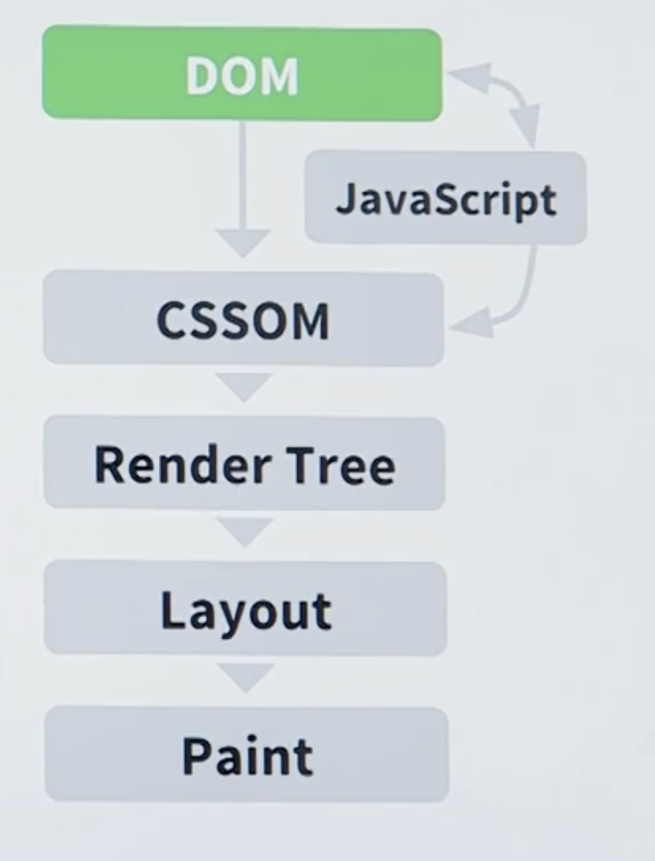
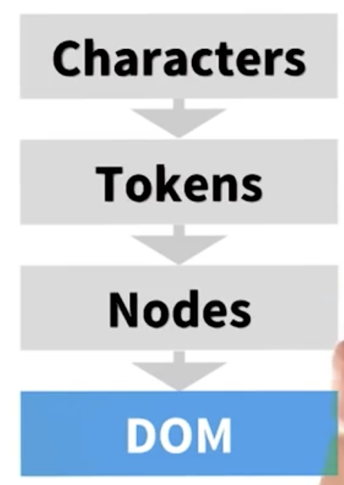
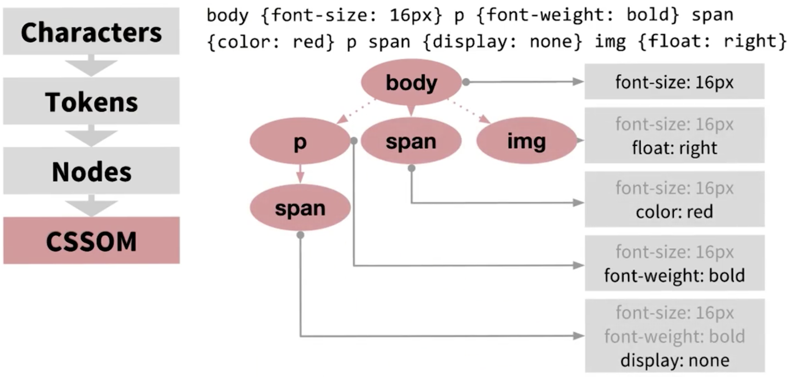

## 一、关键渲染路径

### 1. 关键渲染路径

关键呈现路径是指浏览器所经历的一系列步骤，从而将 HTML,CSS,JavaScript 转换为在屏幕上呈现的像素内容，如果我们懂得优化关键呈现路径，就可以得心应手地提高网页呈现速度，从而提高用户体验。  
除去HTML／CSS 构建文档模型外，JavaScript影响呈现效果也非常明显，它是一个很大的性能问题。

			

### 2. 将 HTML 转换为 DOM

浏览器遵守一系列规则标准，下载HTML文档，从上到下读取并解析HTML，构建成DOM文档。这个过程中HTML渲染引擎识别各种W3C标准定义好的标签，生成节点，并构建成DOM。

	过程：	HTML response > Tokens > Nodes > DOM Tree 

	

### 3. 将 CSS 转换为 CSSOM

选择器多层级会导致多余的DOM遍历，但是一般情况下，选择器匹配效率并不会成为性能瓶颈，但是我们也要注意优雅简洁的CSS选择器写法。

	

### 4. 渲染树

DOM 和 CSSOM 合成渲染树，构建渲染树，会从DOM的根部开始

> 碰到 display:none 的节点，会避免继续读取其下的子节点。

### 5. 计算布局

### 6. 像素呈现

## 二、一般优化策略

- 减少通过网络发送的数据量
- 减少关键关键资源的数量
- 缩短关键呈现路径的长度

常规步骤

- 分析、描述关键路径：关键资源数量、字节数、关键路径长度
- 最小化关键资源数量：删除相应资源、延迟下载、标记为异步资源等
- 减少关键字节数、以减少资源下载时间
- 优化剩余关键字资源的加载顺序：尽可能早的下载所有关键资源，以缩短关键路径长度

### 总结

浏览器性能优化就只有2个点：

- http
- 浏览器的渲染原理（有很多也是http辅助完成的）

