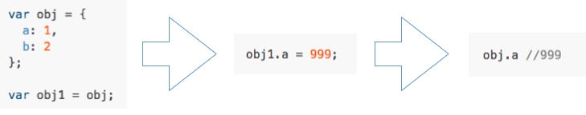

## Immutable

### Part01 Immutable由何而生

说immutable之前，首先看下什么是mutable。js在原生创建数据类型即是mutable，可变的。
const只是浅层次的防篡改，层级一深就没辙了。



js在创建变量、赋值后是可变的。除了基本类型，其他的引用类型，通过变量地址来共享。
改变了obj1.a的值，同时也会改变obj.a的值。其实改变的是同一个对象引用。这样共享地址来共享值的好处是节省内存，坏处是稍微不注意就会导致改A坏B的棘手问题。

#### Deep Copy？No！

一般的解法就是使用深拷贝而非浅拷贝，生成一份基本类型值完全相同但是没有共享地址的数据，除了浪费内存之外，深拷贝复杂引用类型时需要深度遍历，这样的做法在React这样频繁更新数据和对数据更新性能有要求的场景，深拷贝是一个不优雅不推荐，say no的选择。
那怎么做呢，这个时候Immutable就可以闪亮登场解决这个问题，为什么呢？

### Part02 Immutable是个什么


> 相对于mutable，Immutable就是在创建变量、赋值后便不可更改，若对其有任何变更,就会回传一个新值

Immutable只是一个定义，有各种实现，Immutable.js就是facebook工程师实现js的Immutable历时三年的烧脑之作。甚至有些语言天生就是不可变数据结构，比如国内react的早期先驱题叶极力推崇的ClojureScript。
每次返回新值，大家可能会觉得性能也并不好啊，又占内存之类的。如果实现了结构共享，每次的新值共享内部结构以大幅减少内存占用。这意味着，如果对一个Immutable进行赋值1000次，并不会创建1000倍大小的内存占用数据。

> 与原生JS的mutable语义强烈冲突

除非从零开始一个项目，不然这种使用导致我们可能用混，第三方库也只支持原生js对象。
我们需要采用一些手段来规避用混。

1. 使用类型系统，TypeScript或Flow。消除了Immutable流经系统的精神负担。代价是编写风格将颠覆式的完全不同。
2. 隐藏有关数据结构的详细信息。如果您在系统的特定部分使用Immutable.js，请不要在其外部进行任何操作直接访问数据结构。一个很好的例子是Redux，它是单原子app状态。如果app状态是Immutable.js对象，请不要强制React组件直接使用Immutable.js的API。


[https://codesandbox.io/s/yq872yrlnx](https://codesandbox.io/s/yq872yrlnx)

真正的结构共享vs对象代理的伪实现

结构共享是指没有改变的数据共用一个引用，这样既减少了深拷贝的性能消耗，也减少了内存。

extend [https://reactjs.org/docs/update.html](https://reactjs.org/docs/update.html)

### Part03 怎么用

#### 与React搭配使用，关键点是shouldComponentUpdate

熟悉 React 的都知道，React 做性能优化时有一个避免重复渲染的大招，就是使用 shouldComponentUpdate()，但它默认返回 true，即始终会执行 render() 方法，然后做 Virtual DOM 比较，并得出是否需要做真实 DOM 更新，尽管React的虚拟算法复杂度已经有了很多优化，但是在大规模组件更新时，依然会是个不必要的损耗。会带来很多无必要的渲染并成为性能瓶颈。
我们常用的Purecomponent的秘密其实是在shouldComponentUpdate中做了前后state和props的浅比较，如果不小心组件props的引用问题，这里会导致出现很多Bug。
虽然第一层数据没变，但引用变了，就会造成虚拟 DOM 计算的浪费。
第一层数据改变，但引用没变，会造成不渲染，所以需要很小心的操作数据。

#### Object.assign可以实现不可变数据,唯一的就是性能问题

### Part04 怎么实现

#### seamless-immutable

Object.freeze防止对象被修改  
https://developer.mozilla.org/zh-CN/docs/Web/JavaScript/Reference/Global_Objects/Object/freeze

```
function makeImmutable(obj, bannedMethods) {
  // 在对象上打上immutabilityTag标记即表示对象不可变
  addImmutabilityTag(obj);

  if (process.env.NODE_ENV !== "production") {
    // 让所有导致对象改变的方法在调用时抛出错误
    for (var index in bannedMethods) {
      if (bannedMethods.hasOwnProperty(index)) {
        banProperty(obj, bannedMethods[index]);
      }
    }
    // 冻结对象
    Object.freeze(obj);
  }
  return obj;
}
```

确保对象不可变的分三步：

1. 打上immutabilityTag标记；
2. 禁用会导致对象改变的方法；
3. 冻结对象。

#### Immutable-js

精读 Immutable 结构共享 https://juejin.im/entry/59b5e4916fb9a00a3b3bd52d

深入探究Immutable.js的实现机制 https://juejin.im/post/5b9b30a35188255c6418e67c

了解Clojure的持久变量 https://hypirion.com/musings/understanding-persistent-vector-pt-1

### 完结

（此文由PPT摘抄完成）[PPT链接](./Immutable.key)
