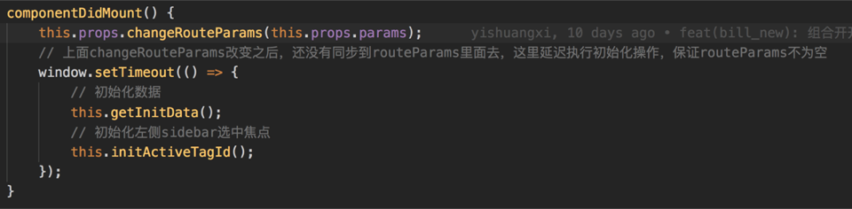

Redux and Router

## Part01 What's the problem



这段代码意图是把router传递props的路由信息再传递给redux。有这么几个问题：

1. 如果靠组件生命周期转发 每个路由下面的顶级组件都要调这样一个action
2. 并且，如果路由有参数改变(很多时候页面状态的参数会在路由中体现)，这段代码是无法检测的，还需要在componentWillReceiveProps里去处理逻辑。
3. 还有这个setTimeout解决异步问题，极度不优雅。

#### Can't cooperate

redux 是状态管理的库，router 是(唯一)控制页面跳转的库。两者都很美好，但是不美好的是两者无法协同工作。换句话说，当路由变化以后，store 无法感知到。

redux是想把绝大多数应用程序的状态都保存在单一的store里，而当前的路由状态明显是应用程序状态很重要的一部分，应当是要保存在store中的。

目前是，如果直接使用react router，就意味着所有路由相关的信息脱离了Redux store的控制，假借组件接受router信息转发dispatch的方法属于反模式，违背了redux的设计思想，也给我们应用程序带来了更多的不确定性。


## Part02 What do we need

我们需要一个这样的路由系统，他技能利用React Router的声明式特性，又能将路由信息整合进Redux Store中。

#### react-router-redux

react-router-redux 是 redux 的一个中间件(中间件：JavaScript 代理模式的另一种实践 针对 dispatch 实现了方法的代理，在 dispatch action 的时候增加或者修改) ，主要作用是：
加强了React Router库中history这个实例，以允许将history中接受到的变化反应到state中去。


## Part03 How to use

```
import React from 'react'
import ReactDOM from 'react-dom'
import { createStore, combineReducers } from 'redux'
import { Provider } from 'react-redux'
import { Router, Route, browserHistory } from 'react-router'
import { syncHistoryWithStore, routerReducer } from 'react-router-redux'

import reducers from '<project-path>/reducers'

const store = createStore(
  combineReducers({
    ...reducers,
    routing: routerReducer
  })
)

const history = syncHistoryWithStore(browserHistory, store)

ReactDOM.render(
  <Provider store={store}>
    <Router history={history}>
      <Route path="/" component={App} />
    </Router>
  </Provider>,
  document.getElementById(‘app')
)
```

使用简单直白的api syncHistoryWithStore来完成redux的绑定工作，我们只需要传入react router中的history（前面提到的）以及redux中的store,就可以获得一个增强后的history对象。
将这个history对象传给react router中的Router组件作为props，就给应用提供了观察路由变化并改变store的能力。
现在，只要您按下浏览器按钮或在应用程序代码中导航，导航就会首先通过Redux存储区传递新位置，然后再传递到React Router以更新组件树。如果您计时旅行，它还会将新状态传递给React Router以再次更新组件树。

#### 如何访问容器组件中的路由器状态？

React Router 通过路径组件的props提供路由信息。这使得从容器组件访问它们变得容易。当使用react-redux对connect()你的组件进行陈述时，你可以从第二个参数mapStateToProps访问路由器的道具：


## Part04 Code principle

#### [https://github.com/reactjs/react-router-redux](https://github.com/reactjs/react-router-redux)

```
// index.js
/**
 * 作为外部 syncHistoryWithStore 
 * 绑定store.dispatch方法引起的state中路由状态变更到影响浏览器location变更  
 * 绑定浏览器location变更触发store.dispatch，更新state中路由状态  
 * 返回当前的histroy、绑定方法listen（dispatch方法触发时执行，以绑定前的路由状态为参数）、解绑函数unsubscribe  
 */
export syncHistoryWithStore from './sync'

/**
 * routerReducer监听路由变更子reducer，通过redux的combineReducers复合多个reducer后使用
 */
export { LOCATION_CHANGE, routerReducer } from './reducer'


/**
 * 构建actionCreater，作为外部push、replace、go、goBack、goForward方法的接口，通常不直接使用 
 */
export {
  CALL_HISTORY_METHOD,
  push, replace, go, goBack, goForward,
  routerActions
} from './actions'

/**
 * 构建route中间件，用于分发action，触发路径跳转等事件
 */
export routerMiddleware from './middleware'
```

```
// sync.js

import { LOCATION_CHANGE } from './reducer'

// 默认用state.routing存取route变更状态数据  
const defaultSelectLocationState = state => state.routing

/** 
 * 作为外部syncHistoryWithStore接口方法 
 * 绑定store.dispatch方法引起的state中路由状态变更到影响浏览器location变更  
 * 绑定浏览器location变更触发store.dispatch，更新state中路由状态  
 * 返回当前的histroy、绑定方法listen（dispatch方法触发时执行，以绑定前的路由状态为参数）、解绑函数unsubscribe  
 */
export default function syncHistoryWithStore(history, store, {
  // 约定redux.store.state中哪个属性用于存取route变更状态数据  
  selectLocationState = defaultSelectLocationState,
  // store中路由状态变更是否引起浏览器location改变  
  adjustUrlOnReplay = true
} = {}) {
  // Ensure that the reducer is mounted on the store and functioning properly.
  // 确保redux.store.state中某个属性绑定了route变更状态  
  if (typeof selectLocationState(store.getState()) === 'undefined') {
    throw new Error(
      'Expected the routing state to be available either as `state.routing` ' +
      'or as the custom expression you can specify as `selectLocationState` ' +
      'in the `syncHistoryWithStore()` options. ' +
      'Ensure you have added the `routerReducer` to your store\'s ' +
      'reducers via `combineReducers` or whatever method you use to isolate ' +
      'your reducers.'
    )
  }

  let initialLocation // 初始化route状态数据  
  let isTimeTraveling // 浏览器页面location.url改变过程中标识，区别页面链接及react-router-redux变更location两种情况 
  let unsubscribeFromStore  // 移除store.listeners中，因路由状态引起浏览器location变更函数  
  let unsubscribeFromHistory  // 移除location变更引起路由状态更新函数  
  let currentLocation // 记录上一个当前路由状态数据  

  // 获取路由事件触发后路由状态，或者useInitialIfEmpty为真值获取初始化route状态，或者undefined 
  const getLocationInStore = (useInitialIfEmpty) => {
    const locationState = selectLocationState(store.getState())
    return locationState.locationBeforeTransitions ||
      (useInitialIfEmpty ? initialLocation : undefined)
  }

  // 初始化route状态数据 
  initialLocation = getLocationInStore()

  // If the store is replayed, update the URL in the browser to match.
  // adjustUrlOnReplay为真值时，store数据改变事件dispatch发生后，浏览器页面更新location
  if (adjustUrlOnReplay) {
    // 由store中路由状态改变情况，更新浏览器location  
    const handleStoreChange = () => {
      // 获取路由事件触发后路由状态，或者初始路由状态  
      const locationInStore = getLocationInStore(true)
      if (currentLocation === locationInStore || initialLocation === locationInStore) {
        return
      }

      // 浏览器页面location.url改变过程中标识，区别页面链接及react-router-redux变更location两种情况 
      isTimeTraveling = true
      // 记录上一个当前路由状态数据  
      currentLocation = locationInStore

      // store数据改变后，浏览器页面更新location
      history.transitionTo({
        ...locationInStore,
        action: 'PUSH'
      })
      isTimeTraveling = false
    }

    // 绑定事件，完成功能为，dispatch方法触发store中路由状态改变时，更新浏览器location
    unsubscribeFromStore = store.subscribe(handleStoreChange)

    // 初始化设置路由状态时引起页面location改变  
    handleStoreChange()
  }

  // 页面链接变更浏览器location，触发store.dispatch变更store中路由状态  
  const handleLocationChange = (location) => {
    // react-router-redux引起浏览器location变更过程中，无效；页面链接变更，有效  
    if (isTimeTraveling) {
      return
    }

    // Remember where we are
    currentLocation = location

    // Are we being called for the first time?
    if (!initialLocation) {
      // Remember as a fallback in case state is reset
      initialLocation = location

      // Respect persisted location, if any
      if (getLocationInStore()) {
        return
      }
    }

    // Tell the store to update by dispatching an action
    store.dispatch({
      type: LOCATION_CHANGE,
      payload: location
    })
  }
  // hashHistory、boswerHistory监听浏览器location变更，触发store.dispatch变更store中路由状态  
  unsubscribeFromHistory = history.listen(handleLocationChange)

  // History 3.x doesn't call listen synchronously, so fire the initial location change ourselves
  // 初始化更新store中路由状态  
  if (history.getCurrentLocation) {
    handleLocationChange(history.getCurrentLocation())
  }

  // The enhanced history uses store as source of truth
  return {
    ...history,
    // store中dispatch方法触发时，绑定执行函数listener，以绑定前的路由状态为参数  
    listen(listener) {
      // Copy of last location.
      // 绑定前的路由状态  
      let lastPublishedLocation = getLocationInStore(true)

      // Keep track of whether we unsubscribed, as Redux store
      // only applies changes in subscriptions on next dispatch
      let unsubscribed = false  // 确保listener在解绑后不执行  
      const unsubscribeFromStore = store.subscribe(() => {
        const currentLocation = getLocationInStore(true)
        if (currentLocation === lastPublishedLocation) {
          return
        }
        lastPublishedLocation = currentLocation
        if (!unsubscribed) {
          listener(lastPublishedLocation)
        }
      })

      // History 2.x listeners expect a synchronous call. Make the first call to the
      // listener after subscribing to the store, in case the listener causes a
      // location change (e.g. when it redirects)
      if (!history.getCurrentLocation) {
        listener(lastPublishedLocation)
      }

      // Let user unsubscribe later
      return () => {
        unsubscribed = true
        unsubscribeFromStore()
      }
    },

    // 解绑函数，包括location到store的handleLocationChange、store到location的handleStoreChange
    unsubscribe() {
      if (adjustUrlOnReplay) {
        unsubscribeFromStore()
      }
      unsubscribeFromHistory()
    }
  }
}
```

```
// reducer.js 
/**
 * This action type will be dispatched when your history
 * receives a location change.
 */
export const LOCATION_CHANGE = '@@router/LOCATION_CHANGE'

const initialState = {
  locationBeforeTransitions: null
}

/**
 * 监听路由变更子reducer，通过redux的combineReducers复合多个reducer后使用，作为外部routerReducer接口  
 * 提示redux使用过程中，可通过子组件模块中注入reducer，再使用combineReducers复合多个reducer  
 * 最后使用replaceReducer方法更新当前store的reducer，意义是构建reducer拆解到各个子模块中  
 * */ 
export function routerReducer(state = initialState, { type, payload } = {}) {
  if (type === LOCATION_CHANGE) {
    return { ...state, locationBeforeTransitions: payload }
  }

  return state
}
```

```
// actions.js
export const CALL_HISTORY_METHOD = '@@router/CALL_HISTORY_METHOD'

function updateLocation(method) {
  return (...args) => ({
    type: CALL_HISTORY_METHOD,  // route事件标识，避免和用于定义的action冲突  
    payload: { method, args }   // method系hashHistroy、boswerHistroy对外接口方法名，args为参数  
  })
}

/**
 * 返回actionCreater，作为外部push、replace、go、goBack、goForward方法的接口，通常不直接使用  
 */
export const push = updateLocation('push')
export const replace = updateLocation('replace')
export const go = updateLocation('go')
export const goBack = updateLocation('goBack')
export const goForward = updateLocation('goForward')

export const routerActions = { push, replace, go, goBack, goForward }
```


## 完结 

（此文由PPT摘抄完成）[PPT链接](./redux与router.key)


