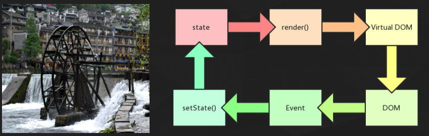
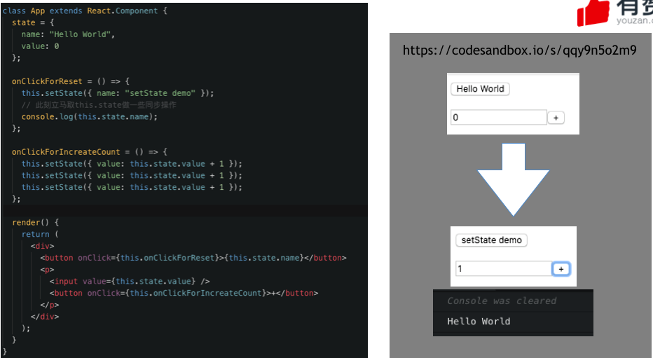
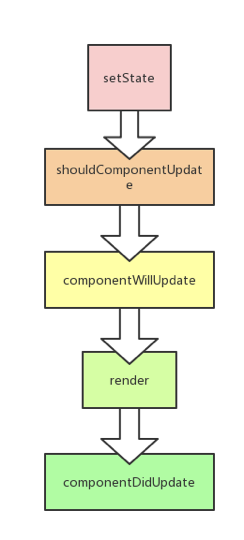
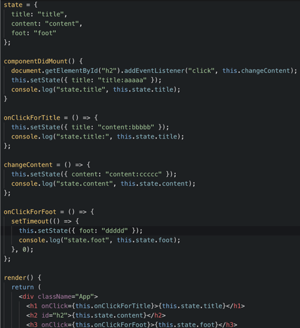
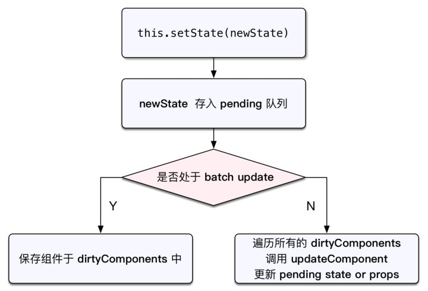
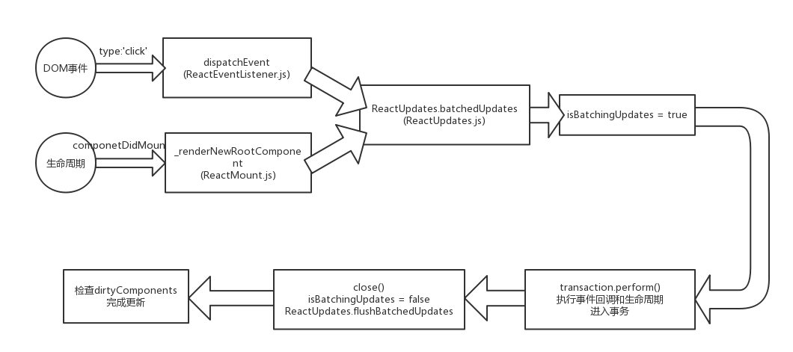

## Part one - setState点燃引擎



这是一个React组件实现组件可交互所需的流程，render()输出虚拟DOM，虚拟DOM转为DOM，再在DOM上注册事件，事件触发setState()修改数据，在每次调用setState方法时，React会自动执行render方法来更新虚拟DOM，如果组件已经被渲染，那么还会更新到DOM中去。
这个过程，setState就像一个点燃引擎的打火石，发动了React核心的调度层，然后直至渲染层的改变。

## Part two - setState是异步的

刚接触React的同学，对React的setState的使用偶尔会有一些偏颇，出现一些意料之外的情况。
比如：

```
onClickForReset=()=>{
	this.setState({value: []});
	// 此刻立马取this.state做一些同步操作
	console.log(this.state.value);
}
```
或者是

```
increateCount(){
	this.setState({count: this.state.count + 1});
	this.setState({count: this.state.count + 1});
	this.setState({count: this.state.count + 1});
}
```

我们可以看一个现在的例子：
[https://codesandbox.io/s/qqy9n5o2m9](https://codesandbox.io/s/qqy9n5o2m9)




setState比较熟练的同学可以跳过这一段代码，但是有些刚学会使用React的同学经常会犯这个错误，一开始我只能粗暴地说：

1. setState是异步的，不会立即改变state的值。
2. 多次setState调用生成的效果会合并。
3. 第二个参数可以是一个回调函数。
4. setState可以接受一个函数（例子改动）

后来我逐渐也在想下面这两个问题，现在这篇文章试图尽量弄清的两件事：

1. 为什么要把setState设计成异步的，缘由是什么，解决了什么问题，有什么好处？
2. 如何实现异步的setState，整体原理是怎样的，有没有什么特殊的骚操作？

我们可以自己也想一想，下面留给大家一片空白区。😝

<div style="background:#fff;width:100%;height:500px;margin-bottom:30px;"></div>

好，我们带着这两个问题和自己的猜想，试图一探究竟。

## Part three - 为什么要异步

简单的来说：在批量多次的更新中，延缓到最后合并渲染是有好处的。


1. 保证内部的一致性：首先，我想我们都同意推迟并批量处理重渲染是有益而且对性能优化很重要的，无论 setState() 是同步的还是异步的。那么就算让 state 同步更新，props 也不行，因为当父组件重渲染（re-render ）了你才知道 props。

2. 在批量多次的更新中，延缓到最后合并渲染是有好处的。这一点，和我们熟知的防抖动函数的出发点类似，我们普遍认为在许多情况下在同一时间段，频繁setState触发渲染，连续同步效率很低，对性能有极大损耗。  

我们来看下setState引发组件的更新过程就知道了：



每一次setState如果都引发一次组件更新，走完一圈生命周期，实在是有点粗糙和浪费，生命周期函数为纯函数性能应当还能够接受，可是render函数内返回的虚拟DOM去做比较这个就比较费时间了。

直观的感受是，React将多个setState产生的修改放在一个队列里，缓一缓，攒在一起，等待时机，觉得差不多了再引发一次更新过程。这样，在每次更新过程中，会把积攒的setState结果合并，做一个merge的动作，节省render触发的频率。  
这样，对于开发者而言，可以在同步代码中随意多行调用setState函数而不用担心重复setState重复render的问题。

然后，总是被大家误用不理解的也是这一点，所以后来，setState方法的第二个参数慢慢被进入大家的视野了，作为回调函数可以再次拿到新的this.state值。

再后来，一个setState函数的隐藏功能进入了大家的视野，那就是，setState可以接受一个函数作为参数。

> 更多：[https://github.com/facebook/react/issues/11527#issuecomment-360199710](https://github.com/facebook/react/issues/11527#issuecomment-360199710)

## Part four - 怎么实现异步

在此之前，我们来看一个例子…可能会颠覆你对setState的认识

我们可以直接打开在线案例：[https://codesandbox.io/s/vq1nqkvyw5](https://codesandbox.io/s/vq1nqkvyw5)



提问：实际运行结果是怎么样的？

## Part five - 彩蛋：setState真的是异步吗？

我们上面一个例子告诉我们：

No！ 可能是同步 超出React生命周期和React代理事件之外都是同步

预知后事如何，请看下半篇。

# 浅入深出setState（下）


## Part one - 同步 or 异步

#### 1. 先说现象吧：

在React中，如果是由React引发的事件处理（比如通过onClick引发的合成事件处理）和组件生命周期函数内（比如componentDidMount），调用this.setState不会同步更新this.state，除此之外的setState调用会同步执行this.state。  
所谓“除此之外”，指的是绕过React通过addEventListener直接添加的事件处理函数，还有通过setTimeout/setInterval产生的异步调用。  

> 如果我们按照教科书般的方式来使用React，基本上不会触及所谓的“除此之外”情况。

#### 2. 再说为什么会这样：（其实只要解开了这个疑问，才能明白setState的异步队列是如何实现的）

在React的setState函数实现中，会根据一个变量`isBatchingUpdates`判断是直接更新this.state还是放到队列中回头再说，而`isBatchingUpdates`默认是`false`，也就表示setState会同步更新this.state，但是，有一个函数`batchedUpdates`，这个函数会把`isBatchingUpdates`修改为true，而当React在调用事件处理函数和自身生命周期之前就会调用这个`batchedUpdates`，造成的后果，就是由React控制的事件处理过程和生命周期中的`同步代码调用`的`setState`不会同步更新`this.state`。

```
注意：同步代码调用，在合成事件和生命周期内的异步调用setState（比如ajax和setTimeout内），也是会同步更新this.setState。
```
Demo请看上篇的[Part Four](https://segmentfault.com/a/1190000015615057#articleHeader3)


所以按照正常React用法都是会经过batchingUpdate方法的。这是由于React有一套自定义的事件系统和生命周期流程控制，使用原生事件监听和settimeout这种方式会跳出React这个体系，所以会直接更新this.state。

我们在看代码是如何实现的，需要了解这样一个东西“事务”，React内部的工具方法实现了一个可供使用的事务。

## Part two - React中的事务

React中的事务借用了计算机专业术语的单词`Transaction `。对比数据库的事务性质，两者之间有共同点却又不是一回事，简答来说 把需要执行的方法用一个容器封装起来，在容器内执行方法的前后，分别执行init方法和close方，其次来说，一个容器可以包裹另一个容器，这点又类似于洋葱模型。

React的合成事件系统和生命周期就使用了React内部实现的事务，为其函数附加了前后两个类似npm脚本pre和post两个钩子的事件。

这是一个`npm srcipt`的例子：

```
"prebuild": "echo I run before the build script",
"build": "cross-env NODE_ENV=production webpack",
"postbuild": "echo I run after the build script"

//用户执行npm run build就会实际执行
npm run prebuild && npm run build && npm run postbuild

//因此可以在两个钩子里做一些准备工作和清理工作。
```

有过有兴趣，我们来看一下如何简单使用事务：[https://codesandbox.io/s/6xl5yrjvzz](https://codesandbox.io/s/6xl5yrjvzz)

```
var MyTransaction = function () {
  //...
};

Object.assign(MyTransaction.prototype, Transaction.Mixin, {
  getTransactionWrappers: function () {
    return [
      {
        initialize: function () {
          console.log("before method perform");
        },
        close: function () {
          console.log("after method perform");
        }
      }
    ];
  }
});

var transaction = new MyTransaction();

transaction.reinitializeTransaction()

var testMethod = function () {
  console.log("test");
};

transaction.perform(testMethod);
```


## Part three - 哪有什么岁月静好,不过是有人为你负重前行

所以，我们可以得到启发，React的事件系统和生命周期事务前后的钩子对isBatchingUpdates做了修改，其实就是在事务的前置pre内调用了batchedUpdates方法修改了变量为true，然后在后置钩子又置为false，然后发起真正的更新检测，而事务中异步方法运行时候，由于JavaScript的异步机制，异步方法（setTimeout等）其中的setState运行时候，同步的代码已经走完，后置钩子已经把isBatchingUpdates设为false，所以此时的setState会直接进入非批量更新模式，表现在我们看来成为了同步SetState。

尝试在描述一下：整个React的每个生命周期和合成事件都处在一个大的事务当中。原生绑定事件和setTimeout异步的函数没有进入React的事务当中，或者是当他们执行时，刚刚的事务已经结束了，后置钩子触发了，close了。（大家可以想一想分别是哪一种情况）。

React“坐”在顶部调用堆栈框架并知道所有React事件处理程序何时运行，setState在React管理的合成事件或者生命周期中调用，它会启用批量更新事务，进入了批量更新模式，所有的setState的改变都会暂存到一个队列，延迟到事务结束再合并更新。如果setState在React的批量更新事务外部或者之后调用，则会立即刷新。

懂得了事务，再回看，就明白，其实setState从来都是同步运行，不过是React利用事务工具方法模拟了setState异步的假象。

延迟队列如何实现，其实有悟性的同学已经可以大概猜到。我们再来捋一捋，看源码是否能验证我们的结论描述和现象。


## Part four - 源码验证

可以对照这张图先来看下setState的流程代码，代码仓库在[我的github的react-source仓库](https://github.com/94dreamer/react-source)，目录已被我精简，剩下关键的源代码文件夹。

 

首先，我们搜索`setState =`看下setState何处被赋值，找到了这里

```
// src/isomorphic/modern/class/ReactComponent.js
/*
 * React组件继承自React.Component，而setState是React.Component的方法，
 * 因此对于组件来讲setState属于其原型方法，首先看setState的定义: 　　
 */
ReactComponent.prototype.setState = function(partialState, callback) {
	// 忽略掉入参验证和开发抛错
   //调用setState实际是调用了enqueueSetState
   // 调用队列的入队方法，把当前组件的示例和state存进入
  this.updater.enqueueSetState(this, partialState);
  if (callback) {
    // 如果有回调，把回调存进setState队列的后置钩子
    this.updater.enqueueCallback(this, callback, 'setState');
  }
};
```

会发现调用setState实际是调用this.updater.enqueueSetState，此时我们不得不看一看updater及其enqueueSetState方法是什么东西，我们在当前文件搜索：

```
function ReactComponent(props, context, updater) {
  this.props = props;
  this.context = context;
  this.refs = emptyObject;
  // updater有默认值，真实运行时会注入，其实也算依赖注入
  this.updater = updater || ReactNoopUpdateQueue;
}
```

ReactNoopUpdateQueue是一个这样的对象，提供了基本的无效方法，真正的updater只有在React被真正加载前才会被注入进来，运行时注入，严格来说是依赖注入，是React源码的风格之一。

```
// src/isomorphic/modern/class/ReactNoopUpdateQueue.js
var ReactNoopUpdateQueue={
	isMounted: function(publicInstance) {
    return false;
  },
  enqueueCallback: function(publicInstance, callback) { },
  enqueueForceUpdate: function(publicInstance) { },
  enqueueReplaceState: function(publicInstance, completeState) { },
  enqueueSetState: function(publicInstance, partialState) { },
}
```

真实的enqueueSetState在这个文件内，方法把将要修改的state存入组件实例的internalInstance数组中，这里就是state的延迟更新队列了。然后立马调用了一个全局的ReactUpdates.enqueueUpdate(internalInstance)方法。

```
// src/renderers/shared/reconciler/ReactUpdateQueue.js

  // 这个是setState真正调用的函数
  enqueueSetState: function(publicInstance, partialState) {
  	 // 忽略基本的容错和抛错
    // 存入组件实例，准备更新
    var internalInstance = publicInstance;
    // 更新队列合并操作 更新 internalInstance._pendingStateQueue
    var queue = internalInstance._pendingStateQueue ||(internalInstance._pendingStateQueue = []);
    queue.push(partialState);

    enqueueUpdate(internalInstance);
    // 发生了什么？猜一下？   ReactUpdates.js
  },
```

> 题外话：每个函数的健壮入参判断和运行环境判断和完善的抛错机制，对来源不信任甚至是内部互调，是React对开发者友好的一个重要原因。

我们来猜下ReactUpdates.enqueueUpdate干了什么？根据上面的流程图我猜想应当是判断流程。

```
function enqueueUpdate(component) {
  ensureInjected(); //环境判断：是否有调度事务方法同时有批量更新策略方法
  //关键的判断条件，是否是批量更新
  //可是isBatchingUpdates这个值谁来维护呢？
  if (!batchingStrategy.isBatchingUpdates) {        // 见词知意 如果不在批量更新策略中
    // 如果不是批量更新，猜想一下，应该会立即更新吧？
    // 唉？batchingStrategy到底在做什么呢
    batchingStrategy.batchedUpdates(enqueueUpdate, component);  // 调用事务
    // 对队列中的更新执行 batchedUpdates 方法
    return;
  }
  // 如果是批量更新，那就把组件放入脏组件队列，也就是待更新组件队列
  dirtyComponents.push(component);
}
```

需要看ReactDefaultBatchingStrategy.js 看 batchedUpdates 方法，这个js文件就有意思了，一上来就是我们之前提到的事务。

避免枯燥，我用人话阐述一下这个js的内容，也可以直接看[ReactDefaultBatchingStrategy.js](https://github.com/94dreamer/react-source/blob/3ae3711909da9b116a8ebbed88ae50d9342e661d/src/renderers/shared/reconciler/ReactDefaultBatchingStrategy.js)

```
var ReactDefaultBatchingStrategy={
	isBatchingUpdates:false,
	batchedUpdates:function(){},
}
```

文件底部声明了 ReactDefaultBatchingStrategy对象,内部isBatchingUpdates初始值为false，这个就是我们心心念念判断是否在批量更新策略的重要变量。  
这个isBatchingUpdates变量搜索整个项目，发现它只被两处改变：

1. 对象自身的另一个batchedUpdates方法固定赋值为true,标识着开启批量更新策略。
2. 一个事务的close钩子，设为false，标识着结束批量更新策略。恰好，这个事务被batchedUpdates调用。

实质上，isBatchingUpdates仅仅也就是被batchedUpdates方法维护着，batchedUpdates调用时开启批量更新，同时入参callback被事务包裹调用，callback调用完成时候事务close钩子触发，关闭批量更新模式。事务的close钩子函数有两个，另一个之前会调用ReactUpdates.flushBatchedUpdates方法，也就是真正的把积攒的setState队列进行更新计算。

问题来了，callback是啥，batchedUpdates方法在setState之前，或者说除了setState还会被谁调用，导致isBatchingUpdates变为true，我猜想是生命周期函数和合成事件，只有这样，整个维护批量更新策略的机制就形成了闭环，验证了我们之前的结论。

我们搜索`batchedUpdates(`,果不其然，在`src/renderers/dom/client/ReactEventListener.js`和`src/renderers/dom/client/ReactMount.js`中找到了ReactUpdates.batchedUpdates的调用。

合成事件和生命周期的装载发生时，调用了`batchedUpdates`方法，使得内部的同步代码都可以运行在批量更新策略的事务环境中，结束后，便使用事务的后置钩子启动merge更新，重置常量。

另外我在`ReactDOM.js`发现了对React顶层API对batchedUpdates方法的引用，可以让 Promise 这些异步也能进入 batch update：

```
unstable_batchedUpdates: ReactUpdates.batchedUpdates,
```

另一个彩蛋，虽然React不提倡使用这个API，以后版本也可能移除，但是现在我们可以这样在React中这样使用：

```
React.unstable_batchedUpdates(function(){
	this.setState({...})
	this.setState({...})
	//...在此函数内也可以使用批量更新策略
})
```

解决了setTimeout和AJAX异步方法、原生事件内的setState批量更新策略失效的问题，让批量更新在任何场景都会发生。

## Part five - 总结



1. this.setState首先会把state推入pendingState队列中。
2. 然后将组建标记为dirtyComponent。
3. React中有事务的概念，最常见的就是更新事务，如果不在事务中，则会开启一次新的更新事务，更新事务执行的操作就是把组件标记为dirty。
4. 判断是否处于batch update。
5. 是的话，保存组建于dirtyComponent中，在事务的时候才会通过。ReactUpdates.flushBatchedUpdates 方法将所有的临时 state merge 并计算出最新的 props 及 state，然后将其批量执行，最后再关闭结束事务。
6. 不是的话，直接开启一次新的更新事务，在标记为dirty之后，直接开始更新组件。因此当setState执行完毕后，组件就更新完毕了，所以会造成定时器同步更新的情况。


