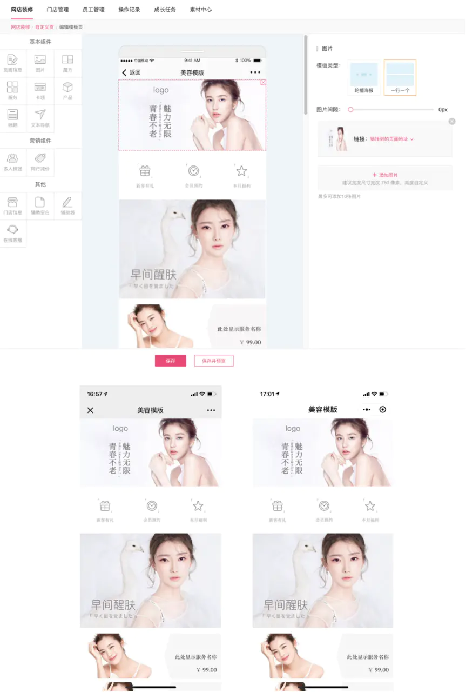
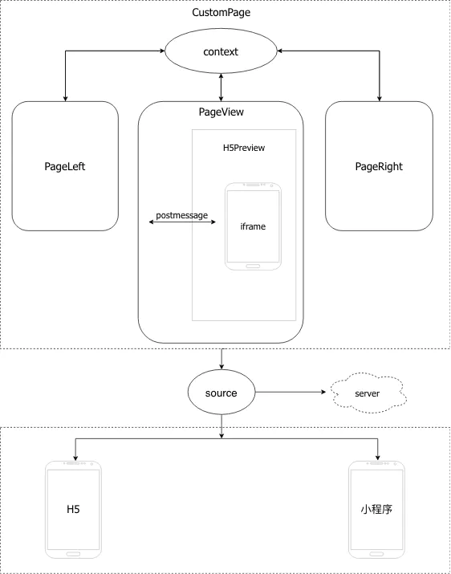

# 有赞美业店铺装修前端解决方案
[有赞美业店铺装修前端解决方案](https://juejin.cn/post/6844903810809200647)

## 一、背景介绍

做过电商项目的同学都知道，店铺装修是电商系统必备的一个功能，在某些场景下，可能是广告页制作、活动页制作、微页面制作，但基本功能都是类似的。所谓店铺装修，就是用户可以在 PC 端进行移动页面的制作，只需要通过简单的拖拽就可以实现页面的编辑，属于用户高度自定义的功能。最终编辑的结果，可以在 H5、小程序进行展示推广。

有赞美业是一套美业行业的 SaaS 系统，为美业行业提供信息化和互联网化解决方案。有赞美业本身提供了店铺装修的功能，方便用户自定义网店展示内容，下面是有赞美业店铺装修功能的截图：



上面的图片是 PC 端的界面，下面两张图分别是 H5 和小程序的最终展示效果。可以简单地看到，PC 端主要做页面的编辑和预览功能，包括了丰富的业务组件和详细的自定义选项；H5 和小程序则承载了最终的展示功能。

再看看有赞美业当前的技术基本面：目前我们的 PC 端是基于 React 的技术栈，H5 端是基于 Vue 的技术栈，小程序是微信原生开发模式。

在这个基础上，如果要做技术设计，我们可以从以下几个角度考虑：

- 三端的视图层都是数据驱动类型，如何管理各端的数据流程？

- 三个端三种不同技术栈，业务中却存在相同的内容，是否存在代码复用的可能？
- PC 最终生成的数据，需要与 H5、小程序共享，三端共用一套数据，应该通过什么形式来做三端数据的规范管理？
- 在扩展性上，怎么低成本地支持后续更多组件的业务加入？

## 二、方案设计

所以我们针对有赞美业的技术基本面，设计了一个方案来解决以上几个问题。

首先摆出一张架构图：



### 2.1 数据驱动

首先关注 CustomPage 组件，这是整个店铺装修的总控制台，内部维护三个主要组件 PageLeft、 PageView 和 PageRight，分别对应上面提到的 PC 端3个模块。

为了使数据共享，CustomPage 通过 React context 维护了一个”作用域“，提供了内部三个组件共享的“数据源”。 PageLeft 、 PageRight 分别是左侧组件和右侧编辑组件，共享 `context.page` 数据，数据变更则通过 `context.pageChange` 传递。整个过程大致用代码表示如下：

```
// CustomerPage
class CustomerPage extends React.Component {
    static childContextTypes = {
        page: PropTypes.object.isRequired,
        pageChange: PropTypes.func.isRequired,
        activeIndex: PropTypes.number.isRequired,
    };

    getChildContext() {
        const { pageInfo, pageLayout } = this.state;
        return {
            page: { pageInfo, pageLayout },
            pageChange: this.pageChange || (() => void 0),
            activeIndex: pageLayout.findIndex(block => block.active),
        };
    }
    
    render() {
    	return (
    		<div>
    			<PageLeft />
            	<PageView />
            	<PageRight />
    		</div>
    	);
    }
}

// PageLeft
class PageLeft extends Component {
    static contextTypes = {
        page: PropTypes.object.isRequired,
        pageChange: PropTypes.func.isRequired,
        activeIndex: PropTypes.number.isRequired,
    };
    
    render() {...}
}


// PageRight
class PageRight extends Component {
    static contextTypes = {
        page: PropTypes.object.isRequired,
        pageChange: PropTypes.func.isRequired,
        activeIndex: PropTypes.number.isRequired,
    };
    
    render() {...}
}
```

至于 H5 端，可以利用 Vue 的动态组件完成业务组件的动态化，这种异步组件的方式提供了极大的灵活性，非常适合店铺装修的场景。

```js
<div v-for="item in components">
	<component :is="item.component" :options="convertOptions(item.options)" :isEdit="true">
	</component>
</div>
```

小程序因为没有动态组件的概念，所以只能通过 if else 的面条代码来实现这个功能。更深入的考虑复用的话，目前社区有开源的工具实现 Vue 和小程序之间的转换，可能可以帮助我们做的更多，但这里就不展开讨论了。

PC 编辑生成数据，最终会与 H5、小程序共享，所以协商好数据格式和字段含义很重要。为了解决这个问题，我们抽取了一个npm包，专门管理3端数据统一的问题。这个包描述了每个组件的字段格式和含义，各端在实现中，只需要根据字段描述进行对应的样式开发就可以了，这样也就解决了我们说的扩展性的问题。后续如果需要增加新的业务组件，只需要协商好并升级新的npm包，就能做到3端的数据统一。

```js
/**
 * 显示位置
 */
export const position = {
    LEFT: 0,
    CENTER: 1,
    RIGHT: 2,
};

export const positionMap = [{
    value: position.LEFT,
    name: '居左',
}, {
    value: position.CENTER,
    name: '居中',
}, {
    value: position.RIGHT,
    name: '居右',
}];
```

### 2.2 跨端复用

PageView 是预览组件，是这个设计的核心。按照最直接的思路，我们可能会用 React 把所有业务组件都实现一遍，然后把数据排列展示的逻辑实现一遍；再在 H5 和小程序把所有组件实现一遍，数据排列展示的逻辑也实现一遍。但是考虑到代码复用性，我们是不是可以做一些“偷懒”？

如果不考虑小程序的话，我们知道 PC 和 H5 都是基于 dom 的样式实现，逻辑也都是 js 代码，两端都实现一遍的话肯定做了很多重复的工作。所以为了达到样式和逻辑复用的能力，我们想了一个方法，就是通过 iframe 嵌套 H5 的页面，通过 postmessage 来做数据交互，这样就实现了用 H5 来充当预览组件，那么 PC 和 H5 的代码就只有一套了。按照这个实现思路，PageView 组件可以实现成下面这样：

```js
class PageView extends Component {
	render() {
        const { page = {} } = this.props;
        const { pageInfo = {}, pageLayout = [] } = page;
        const { loading } = this.state;
	

       return (
            <div className={style}>
                <iframe
                    title={pageInfo.title}
                    src={this.previewUrl}
                    frameBorder="0"
                    allowFullScreen="true"
                    width="100%"
                    height={601}
                    ref={(elem) => { this.iframeElem = elem; }}
                />
            </div>);
        }
}
```

PageView 代码很简单，就是内嵌 iframe，其余的工作都交给 H5。H5 将拿到的数据，按照规范转换成对应的组件数组展示：

```js
<template>
    <div>
        <component
            v-for="(item, index) in components"
            :is="item.component"
            :options="item.options"
            :isEdit="false">
        </component>
    </div>
</template>
<script>
    computed: {
        components() {
            return mapToComponents(this.list);
        },
    },
</script>
```

因为有了 iframe ，还需要利用 postmessage 进行跨源通信，为了方便使用，我们做了一层封装（代码参考自有赞餐饮）：

```js
export default class Messager {
    constructor(win, targetOrigin) {
        this.win = win;
        this.targetOrigin = targetOrigin;
        this.actions = {};
        window.addEventListener('message', this.handleMessageListener, false);
    }

    handleMessageListener = (event) => {
        // 我们能相信信息的发送者吗?  (也许这个发送者和我们最初打开的不是同一个页面).
        if (event.origin !== this.targetOrigin) {
            console.warn(`${event.origin}不对应源${this.targetOrigin}`);
            return;
        }
        if (!event.data || !event.data.type) {
            return;
        }
        const { type } = event.data;
        if (!this.actions[type]) {
            console.warn(`${type}: missing listener`);
            return;
        }
        this.actions[type](event.data.value);
    };
    
    on = (type, cb) => {
        this.actions[type] = cb;
        return this;
    };
    
    emit = (type, value) => {
        this.win.postMessage({
            type, value,
        }, this.targetOrigin);
        return this;
    };
    
    destroy() {
        window.removeEventListener('message', this.handleMessageListener);
    }
}
```

在此基础上，业务方就只需要关注消息的处理，例如 H5 组件接收来自 PC 的数据更新可以这样用：

```js
this.messager = new Messager(window.parent, `${window.location.protocol}//mei.youzan.com`);
this.messager.on('pageChangeFromReact', (data) => {
	...
});
```

这样通过两端协商的事件，各自进行业务逻辑处理就可以了。

这里有个细节需要处理，因为预览视图高度会动态变化，PC 需要控制外部视图高度，所以也需要有动态获取预览视图高度的机制。

```js
// vue script
updated() {
    this.$nextTick(() => {
    	const list = document.querySelectorAll('.preview .drag-box');
	    let total = 0;
	    list.forEach((item) => {
	        total += item.clientHeight;
	    });
	    this.messager.emit('vueStyleChange', { height: total });
    }
}

// react script
this.messsager.on('vueStyleChange', (value) => {
    const { height } = value;
    height && (this.iframeElem.style.height = `${height}px`);
});
```

### 2.3 拖拽实现
拖拽功能是通过 HTML5 drag & drop api 实现的，在这次需求中，主要是为了实现拖动过程中组件能够动态排序的效果。这里有几个关键点，实现起来可能会花费一些功夫：

- 向上向下拖动过程中视图自动滚动
- 拖拽结果同步数据变更
- 适当的动画效果

目前社区有很多成熟的拖拽相关的库，我们选用了vuedraggable。原因也很简单，一方面是避免重复造轮子，另一方面就是它很好的解决了我们上面提到的几个问题。

vuedraggable 封装的很好，使用起来就很简单了，把我们前面提到的动态组件再封装一层 draggable 组件：

```js
<draggable
    v-model="list"
    :options="sortOptions"
    @start="onDragStart"
    @end="onDragEnd"
    class="preview"
    :class="{dragging: dragging}">
    <div>
        <component
            v-for="(item, index) in components"
            :is="item.component"
            :options="item.options"
            :isEdit="false">
        </component>
    </div>
</draggable>

const sortOptions = {
    animation: 150,
    ghostClass: 'sortable-ghost',
    chosenClass: 'sortable-chosen',
    dragClass: 'sortable-drag',
};

// vue script
computed: {
    list: {
        get() {
            return get(this.designData, 'pageLayout') || [];
        },
        set(value) {
            this.designData.pageLayout = value;
            this.notifyReact();
        },
    },
    components() {
        return mapToComponents(this.list);
    },
},
```

## 三、总结

到这里，所有设计都完成了。总结一下就是：PC 端组件间主要通过 React context 来做数据的共享；H5 和 小程序则是通过数据映射对应的组件数组来实现展示；核心要点则是通过 iframe 来达到样式逻辑的复用；另外可以通过第三方npm包来做数据规范的统一。

当然除了基本架构以外，还会有很多技术细节需要处理，比如需要保证预览组件不可点击等，这些则需要在实际开发中具体处理。