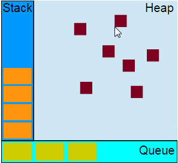

## JavaScript 的 Event Loop

前言：写下这篇日志的主要原因是去富途证券的面试。当时的笔试题看起来十分简单。这是我大概的记忆：

```
//写出下面这段代码的执行结果
for(var i =  0; i < 3; ++i){
	setTimeout(function(){
		console.log(i);
	},0);
}
```
我大笔一挥，毫不犹豫写下了3个3。

后面面试官问我，为什么是3个3，我说循环中使用setTimeout创建了异步队列，在同步循环代码执行完毕，才调用异步队列的回调任务，面试官进一步问我如果实现0，1，2的输出，这部分当然也非常简单，使用一个匿名的自执行函数可以完成。

```
for(var i = 0;i < 3;i++){
	(function(i){
		setTimeout(function(){
			console.log(i);
		},0)
	}(i))
}
```

接着面试官又问我异步队列在JavaScript底层的运行机制和事件循环机制，说老实话我平时真没有把这一块想当然的问题当回事，也没有去深究JavaScript引擎的内部对事件任务的处理机制，今天恰好坐高铁回家，路上就结合资料做做理解的记录吧。

### 一、JavaScript是一门单线程脚本语言

诞生之初就是为浏览器脚本而生，单线程是它最显著的特新，这个特性以后也不太会改变。HTML5的新标准Worker其实也没有改变这个单线程的本质特性。



### 二、事件的调度

#### 1. 事件线程的阻塞

JavaScript 事件处理器在线程空闲之前不会运行。

```
var start=new Date();

setTimeout(function () {
  var end= new Date();
  console.log('Time elapsed:',end-start,'ms');
},500);

while (new Date()-start<1000){};
```

按照思维定势，会预计500毫秒定时器函数就会运行，不过我们会得到大概这样的结果：

`Time elapsed: 1001 ms`

我们大概可以猜到就是后面1000毫秒的循环搞的鬼😄，那到底这个中间出了什么事情，让我们的setTimeout不符合我们的预期呢？


#### 2. 任务队列

调用setTimeout时候，