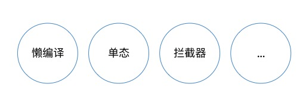

# Tapable of Webpack 

> 本文是由团队内部分享总结成文

这次分享个人想给听众带来这三个方面的价值。

1. 读懂 Tapable 从而更好阅读 Webpack 源码，因为 Webpack 源码充斥了大量有关 Tapable 的实例和方法。
2. 掌握高阶和复杂多变的发布订阅模式的写法，理解一些 Tapable 内部 JavaScript 高性能的特殊模式，比如懒编译。
3. 理解 Webpack 的插件化设计，可以知道 Webpack Plugin 的原理，乃至写一个。

带着这三个价值的期待，我们开始进入内容正题。

## Part01 两者有什么关系
> 通览 Webpack 源码发现 `compiler.js` 大量且核心的依赖就是一个发布订阅的类库，这个类库就是 Tapable。

#### 1. webpack本质是事件流程上的串联 
查看 [Webpack 流程图](https://www.fullstackjavascript.cn/webpackcode.jpg)  
了解 Webpack 打包过程的同学可能知道，我们 Webpack 构建打包过程分为一系列的事件步骤。  
怎么把这些相互依赖或者不依赖的事件控制好，并且提供插件机制，让插件可以挂载在这些不同的事件前后。此时，我们需要有一个专门的角色，「事件流程的管家」。它拥有事件流处理（event stream processing）的软件设计能力，支持实施事件驱动的架构。

#### 2. 这个「事件流程的管家」就是 Tapable

通过阅读 Webpack 的源码可知道，Webpack 的两个核心类，一个控制流程 Compiler、一个负责解析编译的 Compilation，全部继承自 Tapable。

Webpack 的流程化控制就是把一个个事件通过多样的发布订阅模式来达到串行和并行的效果。
Webpack 的插件化在机制就是通过暴露这两个核心类的生命周期上的钩子实现，插件挂载在暴露的切面，并能获取到这两个类的实例。

Webpack 的过程就是通过Compiler发号施令，Compliation专心解析，最后返回Compiler输出文件。
Webpack 可以认为是一种基于事件流的编程范例，内部的工作流程都是基于插件机制串接起来；而将这些插件粘合起来的就是 Webpack 自己写的基础类 Tapable ，pulgin方法就是该类暴露出来的。

Webpack 本质上是事件流的一种机制，它的工作流是将各种插件连接在一起，而实现这一点的核心是 Tapable。

插件是 webpack 生态系统的重要组成部分，为社区用户提供了一种强大方式来直接触及 webpack 的编译过程(compilation process)。插件能够 钩入(hook) 到在每个编译(compilation)中触发的所有关键事件。在编译的每一步，插件都具备完全访问 compiler 对象的能力，如果情况合适，还可以访问当前 compilation 对象。

Webpack最核心的编译 Compiler 和负责创建 bundle 的 Compilation 都是 Tapable 的实例。

#### 3. 要是不相信，看 Webpack 源码

总结一下 Tapable 和 Webpack 的关系，Webpack 就像一条生产线, 要经过一系列的处理流程才能将源文件转换成输出结果。这条生产线上的每个流程都是单一的, 多个流程之间存在依赖关系。只能完成当前处理后才会转交到下一个流程。  
插件就像一个插入到生产线中的一个功能, 它会在特定的时机对生产线上的资源进行处理。  
这条生产线很复杂, Webpack 则是通过 tapable 核心库来组织这条生产线。
Webpack 在运行中会通过 tapable 提供的钩子进行广播事件, 插件只需要监听它关心的事件,就可以加入到这条生产线中,去改变生产线的运作。使得 Webpack 整体扩展性很好。

## Part02 Tapable 提供了什么
> 那 Tapable 究竟为 Webpack提供了什么能力呢？

#### 1. 订阅发布、钩子机制

#### 2. 简单的EventEmitter不就好了吗？

1. 也为了控制好自身的丰富的不同种类的事件
2. 同时为了提供足够的插件能力，也就是钩子上的监听者能以自己想要的方式运行
=> webpack应当需要提供足够多样性和健壮的钩子。
比如：当触发一个事件的时候，就需要确定该事件对应的监听者们执行的顺序、前后是否依赖、监听者出错后如何纠错、前面的出错了是否熔断、监听者是否可能是异步、异步并行还是串行等等。
所以，需要一个类来统一处理这些问题。

#### 3. 所以，需要一个更为强大的类来管理事件流程

它不只是单纯的事件订阅发布中枢，还相应补充了对事件流程的控制能力，通过一系列方法，实现了异步/并行等事件流的控制能力，弥补刚才所说的钩子的触发后续处理能力，

## Part03 Tapable的 Hooks
> 所以如果你想了解webpack的源码，那么先来了解一下Tapable这个基础类显得尤为必要，接下来我们就来尝试实现这些 hooks，并看看 Tapable 内部是怎么代码实现这些。

#### 1. 先来了解一下这个类上的常用的 9个钩子函数吧

这些钩子类型就提供了不同发布订阅模式。

#### 2. 打开编辑器，让我们来实现几个

#### 3. Tapable实现的Hooks有这么简单吗

Hook将使用最有效的方式运行插件来编译方法。它根据以下内容生成代码： 
 
- 已注册插件的数量（无，一，多）  
- 注册插件的种类（同步，异步，承诺）  
- 使用的调用方法（同步，异步，承诺）
- 参数的数量
- 是否使用拦截
- 这确保了最快的执行速度。



参考：

> [https://github.com/webpack/tapable/issues/62](https://github.com/webpack/tapable/issues/62)
> [monomorphism单态是什么？](https://mrale.ph/blog/2015/01/11/whats-up-with-monomorphism.html)
> [2016:编写高性能的 JavaScript](http://web.jobbole.com/89205/) 

## Part04 在 Webpack 的运用
> 结合起来讲， Webpack 如何运用 Tapable 来完成核心流程。

#### 1. 看 Webpack 源码
我们从源码的得知，webpack的内部流程运用了多种钩子将事件串联了起来。

#### 2. [如何写一个webpack的plugin](https://webpack.docschina.org/contribute/writing-a-plugin/)
如何写一个插件，其实就是注册tapable的hooks，webpack到了相应生命周期，自动触发，执行我们注册的回调方法，并且可以拿到编译实例去做一些事情。

我们可以打开文档看看，有必要也可以写一个简单的感受一下。

如何写一个插件，其实就是注册一个tapable的hooks，webpack到了相应生命周期，自动触发，执行我们注册的回调方法。
[https://webpack.docschina.org/contribute/writing-a-plugin/](https://webpack.docschina.org/contribute/writing-a-plugin/)

根据所使用的 钩子(hook) 和 tap 方法，插件可以以多种不同的方式运行。这个工作方式与 Tapable 提供的 hooks 密切相关。compiler hooks 分别记录了 Tapable 内在的钩子，指出哪些 tap 方法可用。

webpack通过plugins实现各种功能。开发者可以通过插件引入它们自己的行为到webpack构建流程中。这就需要我们掌握一些webpack底层构建流程的周期来做相应钩子。

## 结语

看webpack源码算是比较失败的一个选择,代码的可阅读性极差
 