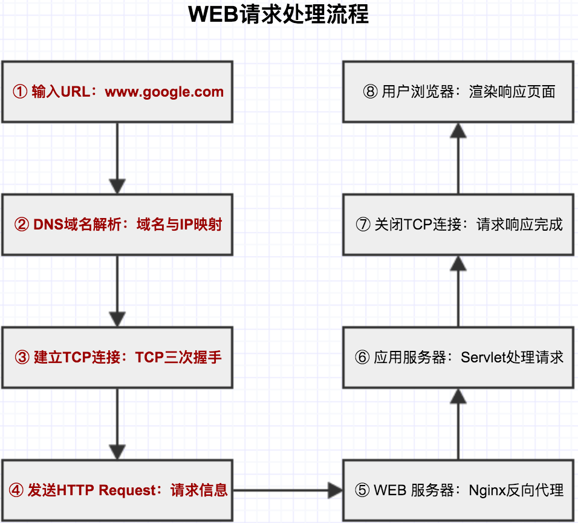
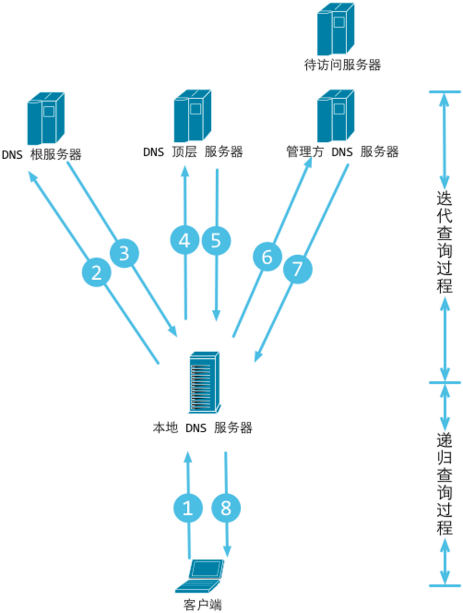

## WEB请求处理 笔记1:浏览器请求发起处理



#### 1. B/S网络架构

基于统一的应用层协议HTTP来交互数据，HTTP协议采用无状态的短链接的通信方式。

当一个用户在浏览器里输入url时，将会发生如下操作：

```
1. 首先，浏览器会请求DNS把这个域名解析成对应的IP地址；
2. 然后，根据IP地址在互联网上找到对应的服务器，建立连接，向这个服务器发起一个HTTP Get请求，有这个服务器决定返回默认的数据资源给访问的用户；
3. 在服务器端实际上还有复杂的业务逻辑：服务器可能有多台，到底指定哪台服务器处理请求，还需要一个负载均衡设备来平均所有用户的请求；（抛出第一个问题：负载均衡设备nginx？）
4. 还有请求的数据是储存在分布式缓存里还是在一个静态文件中，或是在数据库里；
5. 当数据返回浏览器时，如果是一个类型为`text/html`的文件，浏览器会从上到下解析，发现有静态资源（如css、js或者图片）时又会发起另外的HTTP请求，而这些请求可能会在CDN上，那么CDN服务器又会处理这个用户的请求；（抛出第二个问题：CDN资源和普通服务器资源的区别，CDN的特征点）
```


#### 2. HTTP协议解析

B/S网络架构的核心是HTTP协议，最重要的就是要熟悉HTTP协议中的HTTP Header。它控制着用户浏览器的渲染行为和服务器的执行逻辑。

#### 3. HTTP和浏览器缓存

#### 4. DNS域名解析

1. 浏览器缓存检查（本机）
浏览器首先从自身的DNS缓存搜素，如果有且没有过期则解析到此结束。
> Chrome查看自身缓存 使用 chrome://net-internals/#dns
	
2. 操作系统缓存检查（本级）+ hosts解析（本机）
如果浏览器自身的缓存没有，其实操作系统也有一个域名解析的过程，Chrome会首先搜索操作系统自身的DNS缓存中是否有这个域名对应的DNS解析结果。
其次，在大部分系统中可以通过`/etc/hosts`文件来设置，你可以将任何域名解析到任何有效的IP地址。这个配置文件只要被读取，也是会有缓存存在操作系统的。

3. 	本地区域名服务器解析（LDNS）
如果在hosts文件中也没有找到对应的条目，浏览器就会发起DNS的系统调用，就会向本地配置的首选DNS服务器（LDNS一般是电信运营商提供的）发起域名解析请求。
运营商的DNS服务器首先查找自身的缓存，找到对应的条目，且没有过期，则解析成功。

4. 根域名服务器解析（Root Server）
如果LDNS没有找到对应的条目，则由运营商的DNS代我们的浏览器发起迭代的DNS解析请求。它首先找到根域的DNS的ip地址（这个是内置的），就发起请求（询问域名的IP地址）

5. 根域名服务器返回本地域名服务器一个所查询的主域名服务器地址。

6. 本地域名服务器(Local DNS Server)再向上一步返回的gTLD服务器发送请求。

7. 接受请求的gTLD服务器查找并返回此域名对应的Name Server域名服务器的地址，这个Name Server通常就是你注册的域名服务器

8. Name Server域名服务器会查询存储的域名和IP的映射关系表

9. 返回该域名对应的IP和TTL值，Local DNS Server会缓存这个域名和IP的对应关系，缓存的时间由TTL值控制。

10. 把解析的结果返回给用户，用户根据TTL值缓存在本地系统缓存中，域名解析过程结束。

根据以上解析流程，DNS解析整个过程，分为：递归查询过程和迭代查询过程。



#### 5. 发起TCP的三次握手

拿到域名对应的IP地址后，这个连接请求到达服务器端后（这中间通过各种路由设备，局域网内除外），进入到网卡，然后是进入到内核的TCP/IP协议栈，最终达到WEB程序，最终建立了TCP/IP的连接。

TCP为什么需要3次握手？

因为要收到服务器端的应答，如果只有两次，就没办法确定服务器是否正确收到，或者就压根本没有办法发送确定的信息。3次通信是理论上的最小值，并不是TCP本身的要求，而是为了满足‘在不可靠信道上可靠地传输信息’这一需求导致的。

#### 6. 建立TCP连接后发起http请求

经过TCP3次握手之后，浏览器发起了http的请求，使用的http方法的GET方法。


	
