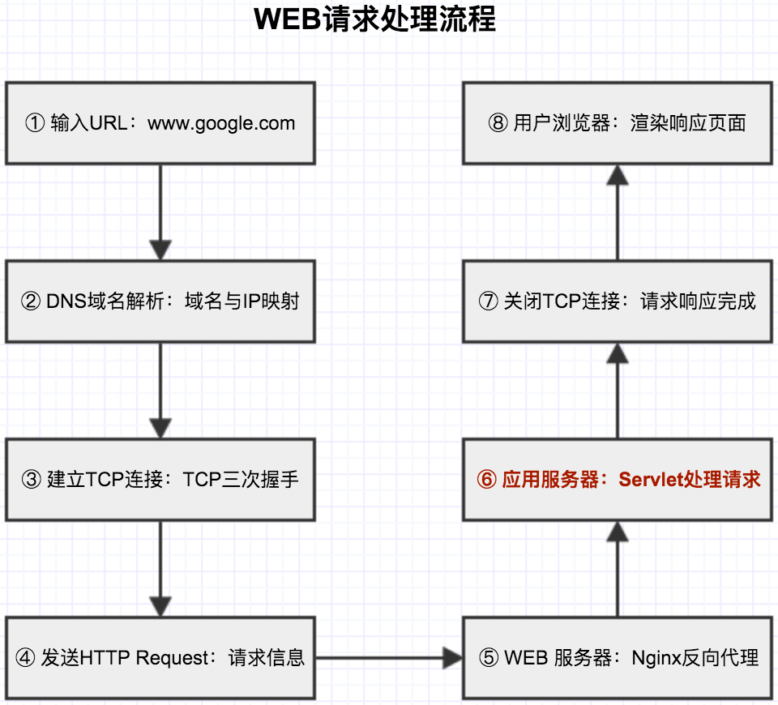

## WEB请求处理 笔记3:Servlet容器请求处理

http://www.jianshu.com/p/571c474279af



> WEB服务器那么多，Apache、Tomcat、Nginx、Jetty、Resin，名词那么多，HTTP Server、Application Server、Web Server、Servlet Container，他们是什么？之间关系是什么？区别又在哪？

> CGI、WSGI、Servlet、JSP、FastCGI等等，他们是什么？他们之间区别又在哪？和上面WEB服务器之间关系是什么？

> Servlet生命周期及工作原理是什么？

> HTTP Request进入到Tomcat中执行，请求处理流程如何？如何找到对应的Application并进行请求处理？

#### 1 WEB服务器

只要Web上的Server都叫Web Server，但是大家分工不同，解决的问题也不同，所以根据Web Server提供的功能，每个Web Server的名字也会不一样。

按功能分类，Web Server可以分为：

```
|- Web Server
        |- Http Server
        |- Application Server
            |- Servlet Container
            |- CGI Server
            |- ......
```

1.1 Http Server

HTTP Server本质上也是一种应用程序——它通常运行在服务器之上，绑定服务器的IP地址并监听某一个tcp端口来接收并处理HTTP请求。

一个HTTP Server关心的是HTTP协议层面的传输和访问控制，所以在Apache/Nginx上你可以看到代理、负载均衡等功能。

HTTP Server中经常使用的是Apache、Nginx两种，HTTP Server主要用来做静态内容服务、代理服务器、负载均衡等。直面外来请求转发给后面的应用服务（Tomcat，django什么的）。

1.1.1 Apache HTTP服务器

Apache HTTP服务器是一个模块化的服务器，可以运行在几乎所有广泛使用的计算机平台上。Apache支持模块多，性能稳定，Apache本身是静态解析，适合静态HTML、图片等，但可以通过扩展脚本、模块等支持动态页面等。

Apache可以支持PHPcgiperl，但是要使用Java的话，你需要Tomcat在Apache后台支撑，将Java请求由Apache转发给Tomcat处理。

1.1.2 Nginx HTTP服务器

Nginx是一个高性能的HTTP和反向代理服务器，同时也是一个IMAP/POP3/SMTP代理服务器。

其特点是占有内存少，并发能力强。Nginx代码完全用C语言从头写成。

具有很高的稳定性。其它HTTP服务器，当遇到访问的峰值，或者有人恶意发起慢速连接时，也很可能会导致服务器物理内存耗尽频繁交换，失去响应，只能重启服务器。例如当前apache一旦上到200个以上进程，web响应速度就明显非常缓慢了。

而Nginx采取了分阶段资源分配技术，使得它的CPU与内存占用率非常低。Nginx官方表示保持10000个没有活动的连接，它只占2.5M内存，所以类似DOS这样的攻击对nginx来说基本上是毫无用处的。就稳定性而言，Nginx比Lighthttpd更胜一筹。

1.1.3 Nginx与Apache比较

Nginx相对于Apache的优点：

```
1. 轻量级，同样启动WEB服务，比Apache占用更少的内存以及资源；
2. 抗并发性能高，核心区别在于Apache是同步多进程模型，一个连接对应一个进程。Nginx是异步的，多个连接（万级别）可以对应一个进程；
3. Nginx模块较少，配置简单，所以Nginx可以将资源用在数据处理以及进程上面，Apache模块较多比较全，相对稳定，但在内存资源上消耗比较大；
4. Nginx可以在不间断的情况下进行软件版本的升级；
5. Nginx处理静态页面性能比apache高3倍多；
```

选择高并发高性能就选择Nginx，如果要稳定，选择Apache，主要根据服务器要面临的需求而定。

当然，两者也可以组合使用：

```
1. Nginx放前端+apache放后端+MYSQL+PHP：可以提高服务器负载能力
2. Nginx处理静态页面请求如MP3，GIF.JPG.JS，apache处理动态页面请求，充分结合了二者的优势；
```

1.2 Application Server

