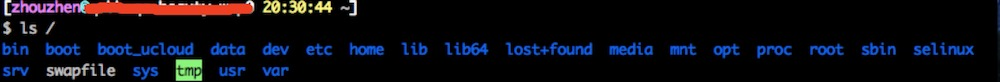
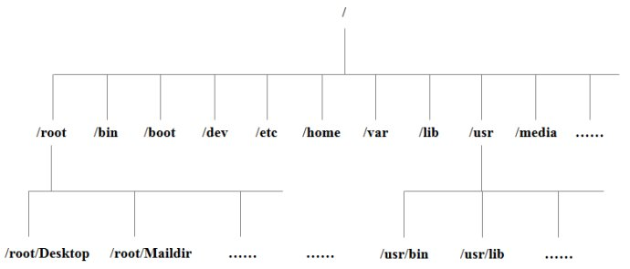

# Linux系统目录结构

登陆系统后，在当前命令窗口输入命令：

`
ls /
`

你会看到如下图：

树状目录结构

以下是对这些目录的解释：

- /bin：bin是Binary的缩写，这个目录存放着经常使用的命令。
- /boot：这里存放是启动Linux时使用的一些核心文件，包括一些连接文件及镜像文件。
- /dev：dev是Device（设备）的缩写，存在的是Linux的外部设备，在Linux中访问设备的方式和访问文件的方式是相同的。
- /etc：这个目录用来存放所有的系统管理所需要的配置文件和目录。
- /home：用户的主目录，在Linux中，每一个用户都有一个自己的目录，一般该目录名是以该用户的账号命名的。
- /lib：这个目录存放着系统最基本的动态连接共享库，其作用类似于Windows里的DLL文件。几乎所有的应用程序都需要用到这些共享库。
- /lost+found：这个目录一般情况下是空的，当系统非法关机后，这里就存放了一些文件。
- /media：linux系统会识别一些设备，例如U盘，光驱等等，当时别后，linux会把识别设备挂载到这个目录下。
- /mnt：系统提供该目录是为了让用户临时挂载别的文件系统的，我们可以将光驱挂载在/mnt，然后进入该目录就可以查看光驱的内容了。
- /opt：给主机额外安装软件所摆放的目录。比如ORACLE数据库则可以放到这个目录下。默认是空的。
- /proc：目录是一个目录，它是系统内存的映射，我么可以通过直接访问这个目录来获取系统信息。
- /root：该目录为系统管理员，超级权限这的用户主目录。
- /sbin：s就是super user的意思，这里存放系统管理员使用的系统管理程序。
- /selinux：这个目录是Redhat/CentOS所特有的目录，Selinux是一个安全机制，类似于windows的防火墙，但是这套机制比较复杂，这个目录就是存放selinux相关的文件的。
- /srv：该目录存放一些服务启动滞后需要提取的数据。
- /sys：这是linux内核的一个很大的变化。该目录安装了2.6内核中新出现的一个文件系统sysfs。
- /tmp：这个目录是用来存放一些临时文件的。
- /user：这是一个非常重要的目录，用户的很多应用程序和文件都放在这个目录下，类似于window下的program files目录。
- /user/bin：系统用户使用的应用程序
- /user/sbin：超级用户使用的比较高级的管理程序和系统守护程序。
- /user/src：内核源代码默认的放置目录。
- /var：这个目录中存放着在不断扩充着的东西。我们习惯将那些经常修改的文件放到这个目录下。包括各种日志文件。

在linux系统中，有几个目录是比较重要的，平时注意不要误删除和更改内部文件。
/etc 系统配置目录，可能会导致系统不能启动。
/bin,/sbin,/user/bin/,user/sbin 这是系统预设的执行文件的放置目录。
/var 程序日志被记录在这个目录下面

