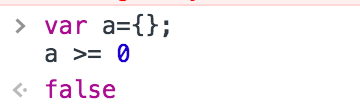

## 一个 `null>=0` 不为 `false` 的扩散

> 作为一个 javascript 老司机今日却不小心在 boolean 判断不慎掉坑了，特此记录，并扩散梳理一下知识点。

今天我写了一段这样的代码

```
className={this.props.notvisitday >= 0 || this.props.visitday >=0 ? null : "active" }
```

在我的思维模式中 当 `notvisitday` 和 `visitday` 只有有一个是数字或者数字字符串时，`className` 就要为 `active`，出乎意料的是 `className` 一直为 `null`。后面断点排查才发现 只要一个属性为 `null` 时就可以为 `true`。

于是我在控制台打下这串代码作为验证：


于是，我通过查阅资料加上自己的理解，有了以下判断和总结：

- `>` `>=` 和 `==` 并不是同一层次的 boolean判断，在''''进行 `> >= < <=`判断是比较式两侧进行隐式转换为number类型。
- 所以 `null == 0` 为false。
- 而 `null >= 0` or `null > 0` 时候 null隐式转换成 `Number(null)` 为 `0`。



- 而 `Number(undefined)` 和 `var a={};Number(a);` 则为 `NaN`。

此这个概念又一个大胆的想法，我又试验了


无一例外，用 `Number`方法可以强制换成0的都可以 `>=0`为真。

#### ！！👀但是，为什么连`null` / `[]`都可以偏偏`{}`空对象不可以转换成数字。


因为 `Number([])` 和 `Number({})` 会首先调用各自的valueOf方法，如果没有得到期望值就会调用`toString`方法，他们的`toString方法的值分别为 `""` ， `"[object Object]"`;
所以 一个为`0`，一个为`NaN`。

值得一提的是 `array` 跟 `object` 的 `toString` 结果不一样是因为，`Array.protptype` 的 `toString` 覆盖了 `Object.proptype` 的 `toString`。


> 如果你认为这是胡乱猜测，这里我贴上javascript高级程序的一段`Number`函数的转换规则：

- 如果是 `Boolean` 值，true 和 false 分别被转换成 1 和 0。
- 如果是数字值，只是简单的传入和返回。
- 如果是 null 值，返回 0。
- 如果是 undefined ，返回 NaN。
- 如果是字符串，遵循下列规则：
	- 如果字符串中只包含数字（包括前面带正号或者负号的情况），则将其转化为10进制数值（注意：前导的0会被忽略）。
	- 如果字符串中包含有效的浮点数格式，如"0.1"，则将其转换为对应的浮点数值（同样忽略前导0）。
	- 如果字符串中包含有效的十六进制格式，如"0xf"，则将其转换为相同大小的十进制数值。
	- 如果字符串是空的（不包含任何字符），则将其转换为 0；
	- 如果字符串包含除上述格式之外的字符，则将其转换为 NaN。
- 如果是对象，则调用对象的valueOf()方法，然后依照前面的规则转换为返回的值。如果转换的结果是 NaN，则调用对象的 toString 方法，然后再次依照前面的规则转换为返回的字符串值。


### 写在最后：
`Number`转换的规则在某些方面的确不够合理，但是JavaScript就是这样一门灵活至极的语言，我们在书写判断式时，千万要对各种类型的隐式转换小之又小心！😂，在不确定的情况下 我们宁可牺牲判断式长度也不可做模凌两可的简单判断。