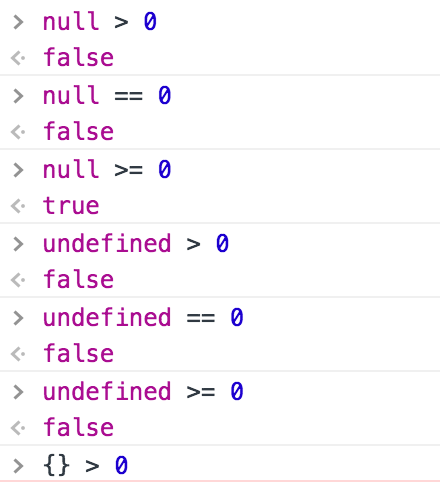
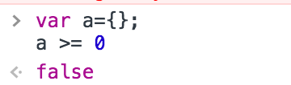
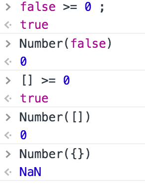

## 一个 `null>=0` 为 `false` 的扩散

> 作为一个 javascript 老司机今日却不小心在 boolean 判断不慎掉坑了，特此记录，并扩散梳理一下知识点。

今天我写了一段这样的代码

```
className={this.props.notvisitday >= 0 || this.props.visitday >=0 ? null : "active" }
```

在我的思维模式中 当 `notvisitday` 和 `visitday` 只有有一个是数字或者数字字符串时，`className` 就要为 `active`，出乎意料的是 `className` 一直为 `null`。后面断点排查才发现 只要一个属性为 `null` 时就可以为 `true`。

于是我在控制台打下这串代码作为验证：



于是，我通过查阅资料加上自己的理解，有了以下判断和总结：

- `>` `>=` 和 `==` 并不是同一层次的 boolean判断，在''''进行 `> >= < <=`判断是比较式两侧进行隐式转换为number类型。
- 所以 `null == 0` 为false。
- 而 `null >= 0` or `null > 0` 时候 null隐式转换成 `Number(null)` 为 `0`。

- 而 `Number(undefined)` 和 `var a={};Number(a);` 则为 `NaN`。

此这个概念又一个大胆的想法，我又试验了



无一例外，用 `Number方法可以强制换成0的`都可以喝 `>=0`为真。

#### ！！👀但是，为什么连`null`都可以偏偏`{}`空对象不可以转换成数字。


