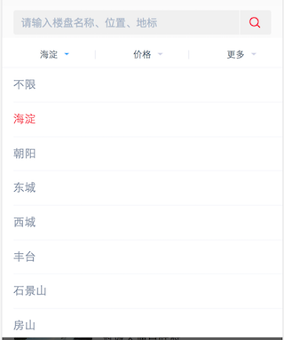

## 前端攻城狮学SEO

前言：
> 为了让C端的大流量页面从搜素引擎网站获取更多的入口流量，我们就必须总结SEO专家的经验，在书写代码时有所侧重，权衡利弊，在SEO和用户体验之间找到平衡点，防止用户体验不佳流失访问，又要在搜索引擎收录中获取更多流量入口，这才是我们想要的站点。

1. 路由的url查询条件不用`?`号，可以试着尝试用 `esf.sina.com/house/search/bj/b0-c0-d0/`这种或者用#号代替？`m.leju.com/house/bj/s/#ln=index_dh`这两种。
2. 保证静态链接，而不是js内控制`location.href`跳转。
3. 路由层级不要太深，导致爬虫需要爬取层级过深。 
4. 像下面的信息列表的展示，显示的可以控制数量，但是尽量在html里面多一些，然后后面的`div`进行`overflow`隐藏。
5. 像这样的单个模块要到做到多链接，图片和标题都带上url链接，而不是用一个``包裹。
6. 和4点大同小异，预加载的列表尽可能在代码中体现出数量多（但是也要有个度。。。），受屏幕空间限制的原因展示数量可以控制。 
7. 像这种筛选尽量做成带跳转链接的，而不是单纯的动态js来控制局部刷新。
8. 重要的信息列表的展示第一次展现尽量不要用js动态加载。
9. 注意``标签的`alt`属性一定要带上图片关键信息，善用标题标签的`title`属性。
10. 还是老原则，能用``的跳转就不用javascript去代码跳转，这样才能让爬虫顺利爬去更多页面链接。
11. 像一般的作弊手段，关键字重复甚至css作弊，搜索引擎都能够识别出来，数量多了也会降低权重作为惩罚。
12. 像这样的轮播图，我们在父级中加入稍多图片而不是只有一两张，图片外层最好带一个链接跳转到改图片详情页，这样也能够增强本页面的爬虫访问量。
13. 关键词的密度在不违反SEO作弊的情况下和影响用户体验以及布局的前提下，我们让它尽可能在页面多出现几次，比如说商品详情页的商品名字。
14. 同站下的各个页面之间打通跳转，最好让几者之间可以相互跳转，爬虫就可以更好地收录。
15. 标题这种页面的权重第一的重点信息，最好是使用`<h1></h1>`标签。
16. 结合上一点，我们的html结构要考虑web语义化，结构清晰可读的html源码能够被更好的爬虫抓取并分析。
17. 善用`<head>`内的`<title>`和`<meta>`标签，title不用太长，关键信息放前面，防止被截取丢失，keywords关键词要精确。
18. 增加跳转入口和友链，打通跳转。
19. 路由url的结尾最好统一加上`/`。
20. 不用``标签包裹大量层级的div，这样会影响分析链接权重。

### 核心思想：我们的页面要为搜索引擎要能在页面结构中更好收录和识别提供方便的条件。

### 闲话：
>很奇怪的一点10年前我们的web站点极尽所能，为SEO服务，在Web2.0来临之后，Javascript的异步渲染越来越流行，我们的Web站点在做SEO的过程中，就弱于了高用户体验的考虑。但是近两年以来，大张旗鼓的服务端渲染，Node直出越多越多，这似乎是一个轮回。就和html／css／js一样，一开始我们喜欢写行内样式，行内脚本，后来我们倡导表现与内容分离，近两年在react带动的潮流下，封装这三者的时代反而又回来了。
