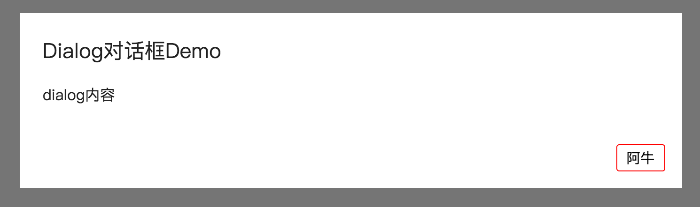

## 实现一个完善的React对话框组件

首发Github地址：[github.com/94dreamer/Note](https://github.com/94dreamer/Note)  
博客地址：[94dreamer.com](http://94dreamer.com)  
转载请联系作者：503633021@qq.com

对话框Dialog作为Web前端的典型组件，在任何一种Web系统内的占比都举重若轻，我们每一种前端框架的使用者都需要对对话框做封装，让其方便调用，来服务我们的前端开发。  
接下来我们就一起来构思并实现一个尽可能完善的 *React对话框组件*，这个过程中我们力求 HTML／CSS／JS 高度内聚，实现了组件化即插即用的效果，其实这种追求也代表了未来`Web Components`的趋势。

### 1. 描述功能

我们想要这么一个Dialog组件，至少包括如下功能

- 基本的对话框样式，并支持自定义覆盖样式
- 自定义的点击按钮和点击回调
- 任意的content内容，并支持选择content的高度宽度scroll能力选择
- 有模态控制，非模态下可以点击Dialog以外关闭对话框
- 窗口resize时、content内容update时，可以控制是否重新定位Dialog的居中位置

### 2. 基本的HTML结构

```
<div className="box-container"> <!--最外层容器-->
<div className="dialog-container"> <!--定位容器／动画容器-->
    <div className="dialog"> <!--dialog容器-->
        <div className="dialog-title"> <!--顶部标题栏-->
            <p>{title}</p>
            <button>X</button>
        </div>
        <div className="dialog-content"> <!--主体容器-->
            {this.props.children}
        </div>
        <div className="dialog-action"> <!--底部按钮容器-->
            <button>取消</a>
            <button>确定</a>
        </div>
    </div>
</div>
<div className="overlay"></div> <!--遮罩层-->
</div>
```
### 3. 基本CSS布局

Modal框的背景遮罩层样式通过position:fixed + top/right/bottom/left:0 + height: 100%实现。

```
position: fixed;
height: 100%;
width: 100%;
top: 0px;
left: 0px;
opacity: 1;
background-color: rgba(0, 0, 0, 0.541176);
will-change: opacity;
transform: translateZ(0px);
transition: left 0ms cubic-bezier(0.445, 0.05, 0.55, 0.95) 0ms, opacity 400ms cubic-bezier(0.445, 0.05, 0.55, 0.95) 0ms;
z-index: 1400;
```
不定宽高的主体内容水平垂直居中的实现通过position:fixed + top/left: 50% + translate(-50%, -50%)实现。

```
position: fixed;
top:50%;
left:50%;
translate(-50%, -50%);
transform: translateZ(0px);
transition: left 0ms cubic-bezier(0.445, 0.05, 0.55, 0.95) 0ms, opacity 400ms cubic-bezier(0.445, 0.05, 0.55, 0.95) 0ms;
z-index: 1500;
```

#### ❓为什么dialog的组件DOM一定要放在body根下，fixed不是无论DOM层级在哪都是根据body定位吗？  

1. 因为fixed元素并不总是相对于视窗进行定位的，父元素发生变换，也就是transfrom属性发生改变，如平移或旋转，会对固定定位的子元素产生影响 例子：[固定定位不固定](http://codepen.io/huangbuyi/pen/mRYXbg)。  
2. 如果父级元素的z-index的层次比同级元素低，就算fixed的z-index比父级高，也会被父级同级元素遮挡。

### 4. 如何从React层面来实现

这样我们先用JSX描述出基本布局和porps控制事件

```
import React, { Component, PropTypes } from 'react'
import 'dialog.css';//引入样式文件 此处省略CSS Mouldes 或者 style in js的css模块化方案讨论
class Dialog extends Component {
	static propTypes = {
	    actions: PropTypes.node,//接受一个react element或者react element的数组
	    actionsContainerClassName:PropTypes.string,//添加到action按钮的容器元素上面的class名
	    bodyClassName: PropTypes.string,//dialog的容器的class名
	    children: PropTypes.node,//dialog的主体.
	    className: PropTypes.string,//根容器class
	    contentClassName: PropTypes.string,//content的class
	    modal: PropTypes.bool,
	    	//模态框
 			//这将导致用户必须使用dialog的action按钮之一才能逃离模态界面
     		//点击dialog主体部分之外将不会触发onRequestClose
	    onRequestClose: PropTypes.func,
	    	//当dialog被在外面点击或者点击按钮时 发生的回调函数
     	 	//@param {bool} buttonClicked 将被传入，表示是否是按钮点击导致触发的回调.
	    open: PropTypes.bool.isRequired,//控制dialog是否显示
	    overlayClassName: PropTypes.string,//遮罩层的class
	    repositionOnUpdate: PropTypes.bool,//确定对话框的内容更新时是否应该重置位置
	    title: PropTypes.node,//dialog的标题，可以是数字、字符串、元素或者包含它们的数组
	    titleClassName: PropTypes.string,//title标题的class    
	};
    
	componentDidMount() {
		this.positionDialog();
		//给window全局绑定 resize和 keyup
	  	window.addEventListener('resize', this.handleResize);
	  	window.addEventListener('keyup', this.handleKeyUp);
  	}

	componentDidUpdate() {
		this.positionDialog();
  	}
  	
  	componentDidUnmount(){
  		window.removeEventListener('resize', this.handleResize);
  		window.removeEventListener('keyup', this.handleKeyUp);
  	}
  	
  	positionDialog() {
  		//doSomeThing 来重置Dilog的位置和最大高度限制等
  		//关键代码是fingDOM()/this.refs/DOM的高度API等 此细节不深入了
  	}
  	
  	requestClose(buttonClicked) { //buttonClicked 标示触发关闭弹窗的是否为按钮
  		if(!buttonClicked && this.props.modal){ 
  			return; //如果不是按钮触发close同时dialog是模态框，就return
  		}
  		this.props.onRequestClose && this.props.onRequestClose(buttonClicked)
  	}
  	
  	handleClickOverlay = () => { //箭头函数避免this错误
  		this.requestClose(false);
  	}
  	
  	handleKeyUp = (event) => {
  		if(!this.props.open){
  			return;
  		}
  		if(event.keyCode==27){ //esc的keyCode码
  			this.requestClose(false);
  		}
  	}
  	
  	handleResize = () => {
  		if(!this.props.open){
  			return;
  		}
  		this.positionDialog();
  	}
  	
  	render(){
  		const {title, children, actions, open ,modal} = this.props;
  		return (
		<div className="box-container">
			{open &&
			<div className="dialog-container">
			    <div className="dialog">
			        <div className="dialog-title">
			        	{title}
			        </div>
			        <div className="dialog-content">
			        	{children}
			        </div>
			        <div className="dialog-action">
			        	{actions}
			        </div>
			    </div>
			</div>
			}
			{open &&
			<div className=`overlay ${modal?'transparent':''}` 
				onClick={this.handleClickOverlay}
			></div>
			}
		</div>
  		)
  	}
}
```

### 5. 解决了dialog的正常布局思路，在react层面我们需要思考这么几个问题：

- 如何实现把Dialog组件渲染置body根下，在正常的React模式中我们没办法在组件外进行操作。

	答案就在这个react-dom的不常用API：unstable_renderSubtreeIntoContainer(parentComponent, nextElement, container, callback)，这个API可以更新组件到传入的 DOM 节点上，我们在这里使用它完成了在组件内实现跨组件的 DOM 操作。
	于此，我们需要重写组件的render方法和重新自定义一个渲染方法组件。
	
	```
	class Modal extends Component{
		componentDidMount() {
			this.renderLayer();
		}
			
		componentDidUpdate() {
			this.renderLayer();
		}
			
		componentWillUnmount() {
			this.unrenderLayer();
		}
		
		unrenderLayer() {
			if(!this.layer){
				return;
			}
			unmountComponentAtNode(this.layer); //销毁指定容器内的所有React节点
			document.body.removeChild(this.layer);
			this.layer=null;
		}
		renderLayer() {//自定义渲染
			if(!open){
				this.unrenderLayer()//卸载
				return;
			}
			if(!this.layer){
				this.layer=document.createElemnt('div');
				document.body.appendChild(this.container);
			}
			unstable_renderSubtreeIntoContainer(this,this.props.children,this.layer)
		}
		render() { 
			return null;
		}
	}
	```

- 组件需要一些基本的动画 防止动作干涩

	react官方提供的react-addons-css-transition-group／非官方的react-addons-transition-group
	为此我们需要在dialog容器包裹一层动画组件容器
	
	```
	<ReactCSSTransitionGroup
		transitionName="example"
      	transitionEnterTimeout={500}
      	transitionLeaveTimeout={300}>
		<div className="dialog-container">
		    <div className="dialog">
		        <div className="dialog-title">
		        	{title}
		        </div>
		        <div className="dialog-content">
		        	{children}
		        </div>
		        <div className="dialog-action">
		        	{actions}
		        </div>
		    </div>
		</div>
    </ReactCSSTransitionGroup>
	```
- 关于到Dialog的位置和尺寸渲染，我们还需要一些react之外的DOM操作

	React的声明式渲染把复杂的DOM操作抽象为简单的state和props的操作，不过我们时常不得已使用一些React之外的DOM操作，比如以下这几个典型的DOM查询和上面的全局事件绑定，在React组件开发中，我们还会遇到很多意料之外的事情，如何用React的方式优雅解决它们，相信这是我们更多需要思考的。

```
function getWidth(){
	//...
}
function isDescendant(parent, child){
	let node = child.parentNode;
	while (node !== null) {
		if (node == parent) return true;
		node = node.parentNode;
    }
    return false;
}

function offset(el){
	const rect = el.getBoundlingClientReact();
	return {
      top: rect.top + document.body.scrollTop,
      left: rect.left + document.body.scrollLeft,
	}
}
```

### 6. 使用

```
const {open} = this.props; //接受变量控制dialog的显示
return (
	<Modal>
		<Dialog 
			title="Dialog对话框Demo" 
			open={open} 
			modal={false} 
			action={<Button children="阿牛" />}
			onRequestClose={ ()=>{this.changeOpen()} }
		>
			Dialog内容
		</Dialog>
	</Modal>
)
```
