 # 有赞美业前端： 持续标准化 Code Review

> 关键字：代码质量 团队建设 流程优化

## 一、背景

#### 1. 技术栈
美业技术团队前端对外的业务项目的主要编程技术栈是：
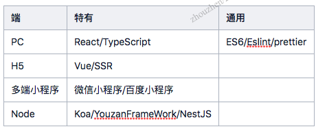

#### 2. 团队架构
在构建项目的前期，前端对业务项目按端来划分人员，各端各司其职，各自沉淀。  

中期随着产品的基本成型，前端团队人员按照业务领域划分成了多个子业务组前端，各组负责4端中对应模块的业务。  

于是，我们美业团队20个前端几乎每个人都要维护4个不同的编码上下文的项目，好处是技术多样性丰富，但是瓶颈也同样存在，一个人需要拥有多端的开发能力，在编码规范和代码风格检查尽可能统一的情况下，因为上述技术体系的差异，我们还是不得不需要熟悉四端的技术架构、开发流程、数据流处理、资产市场、最佳实践。

这是很有挑战的，业务小组之间成立了一个小型的前端技术委员会，来应对这种变化。

- 总结原先的项目技术规范，统一宣讲、培训、文档化
- 打造统一标准化的研发流程
- 并且持续汲取新的实践并迭代

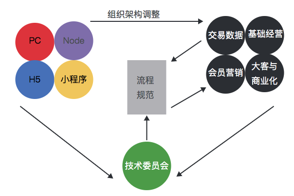

#### 3. 代码质量问题
随即，我们在代码质量上迎来了一些问题：

- 项目Bug较多，同样的坑不同的人会踩
- 迭代后的代码难维护，包括代码可读性差、复用度低等
- 模块的整体设计也欠缺，扩展能力难以支撑业务发展。

对代码质量的把控方面，现状流程是：我们半年要对几端的项目代码进行一次整体的code review。

但是和垃圾回收一样，整体的标记清除占用人员的时间较长，会影响届时涉及人员的业务开发进度。

于是我们想探索一种适合我们团队和业务发展的小步快跑模块的 Code Review，尽可能早的从一开始就参与进来，更高频率，增强审查和设计把控，减少后面返工和带来Bug所影响的整体效率。

## 二、定义需求
有了这样的背景和改进诉求，我发现我们得重新定义一下我们做这件事情的目的和价值。  
经过思考和讨论，我们做 Code Review 的核心目的只有两个：

- 从源头把控代码质量和效率
    - 统一代码评判标准和认知
    - 发现边界问题
    - 提出改进建议
- 共享和迭代集体代码智慧
    - 交流计思路和编码实践
    - 沉淀最佳实践
    - 迭代统一规范


同时要做上述理想中的 Code Review，我们可能不得不面临这些实践过程中会遇到的问题：

- 什么时候 review？
- review 应该关注哪些点？
- review 的评判标准是什么？
- review 除了代码规范和逻辑问题还能看什么？
- 如何发现深层次问题？
- 找谁 review？
- review 的建议，真的改了吗？
- 小的点会改，大的调整怎么办？
- 通过 review 各方收获了什么？

基于这些诉求和待解决问题，我们需要对整体的标准和每一次 Code Review 的关键控制点进行细化和量化，于是有了我们第一版 Code Review 的 SOP（标准作业流程）。

## 三、V1.0 标准化SOP
#### 1. 建立规范
#### 1.1 宣讲
宣讲各端统一代码规范和最佳实践、编码原则
#### 1.2 review 小组
成立专门的 code review 小组，小组成员是各端经验丰富的人员
#### 1.3 设定可迭代的代码质量评价维度和标准：
每项1~5分，基准分为3分，得分在此基础上根据评分点浮动，总评分为各项得分的平均分：

```
- 基本面
    - 难度大、工作量大，可酌情加分
    - 是否符合基本规范
- 架构设计
    - 如果有设计文档，是否按照设计文档思路来写代码，是可酌情加分
    - review的人是否发现了更好的解决方案
    - 代码是否提供了很好的解决思路
- 代码
    - 是否明显重复代码
    - 是否合理抽取枚举值，禁止使用“魔法值”
    - 是否合理使用已有的组件和方法
    - 对已有的、不合理的代码进行重构和优化
    - 职责（组件、方法）、概念是否清晰
- 健壮性
    - 边界和异常是否考虑完备
    - 在review阶段是否发现明显bug
    - 是否考虑安全性（xss）
- 效率
    - 是否抽取共用常量到beauty-const库，加分
    - 是否抽取沉淀基础组件和通用业务组件到组件库，加分
```

#### 1.4 申请格式
code 人在企业微信群发起 Review 申请，统一参考格式，内容包括

```
- mr地址
- 产品文档
- UI稿
- 技术设计
- 效率平台
- 接口文档
```

#### 1.5 review 要求
```
- code review 必须在提测前进行
- mr 统一由 feature 分支合到 release 分支
- review 人根据 code review 评分标准 打出各项评分，计算出本次 code review 总评分
- 有需要可在备注中说明原因，代码相关的备注可以直接在 gitlab 进行
- code 解决反馈的问题
- 要求提测邮件中体现 code review 情况（评分、遗留问题）
- review 记录，定期同步分享
```
#### 1.6 review 重点
```
- 建议check代码改动范围，重点关注核心代码改动的影响
- review可以针对重点代码进行
- 每项checklist，如果有不符合checklist内容的，请在后面【评分解释】中具体指出
- 「讨论沉淀」内容可包括但不限于：技术设计情况、review过程中发现的亮点与不足、值得探讨的东西、发现的bug
- 周会定期同步 review 情况，分享优秀代码
```

#### 2. 单次流程

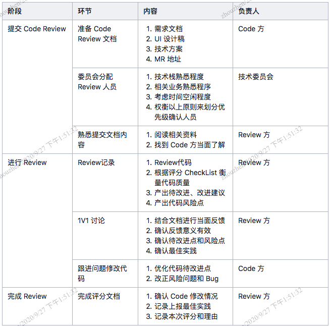

#### 3. 产出示例

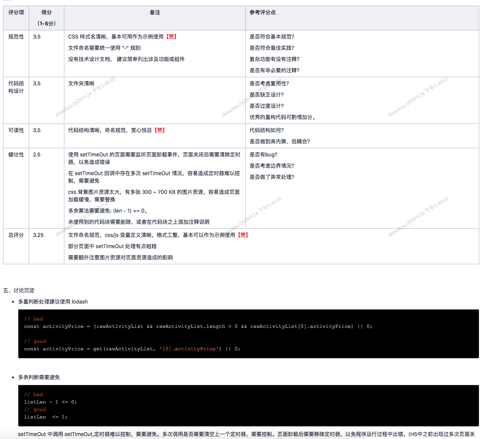

## 四、V2.0 平台化

1.0版本在持续的细节迭代，做到了比较满意的标准化作业，但是有几个比较大的缺陷：

1. 操作欠缺自动化
    - 流程的很多环节明显可以自动化，节省重复的工作量
    - 对流程的把控依赖人，容易执行不到位
2. 信息欠缺数字化
    - 对 code review 的评分统计需要人工，工作量大
    - code review 的总览和数据分析可以支撑更好的判断团队问题和决策提升整体代码质量的策略
3. 流程欠缺可视化
    - 所有流程应该是可以大盘总览，单个详情全面的
    - 每个code review事务的状态是可见的

所以我们有了把 Code Review 整套流程做成已有的内部前端工具平台中一个模块的想法，以期达到可视化、自动化、数字化的目的。

投入产出比是我们需要考虑的，我们很笃定。因为虽然这件事情没有直接的业务价值，但是有非常好的质量把控和能力量化的价值，并且有标杆式的团队建设价值，人员成长了，更好地为业务服务。

#### 1. 需求分析
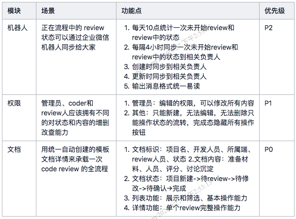

在完成上述基本需求之后，我们同时在收集反馈新增了
1. code 人可指定 review 人员
2. 支持项目多端配置
3. 首页 review 得分榜排名展示
4. 最佳实践统一导出
5. 打通关联项目平台串联项目

#### 2. 技术设计
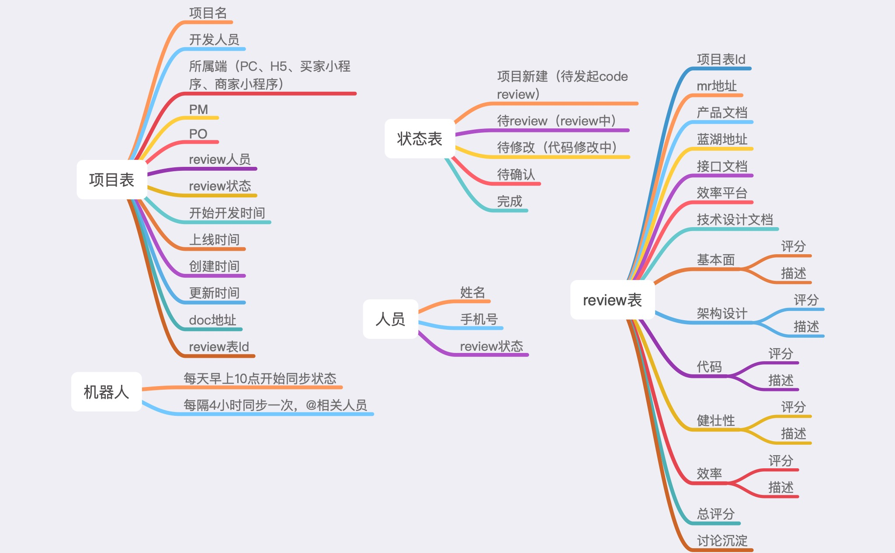

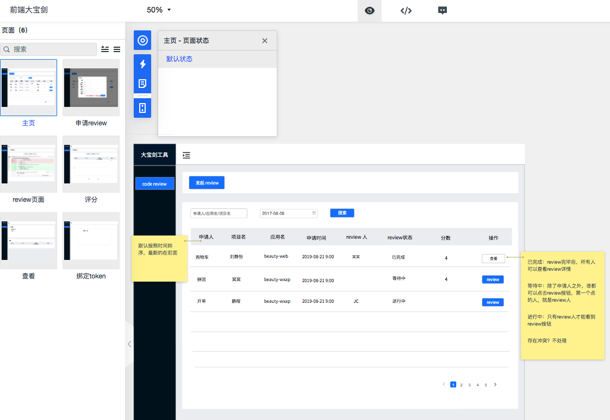

结合数据库表设计之后，我们就分工开整了。

#### 3. 产品效果图

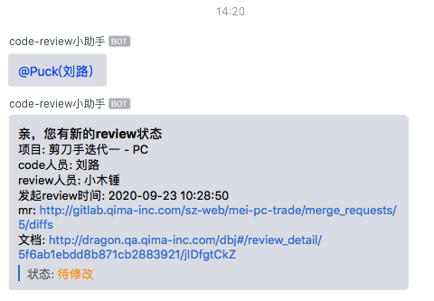

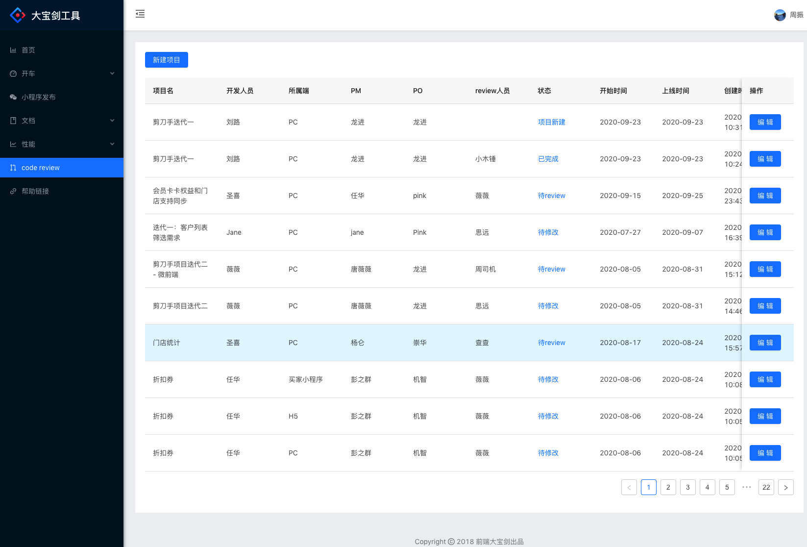

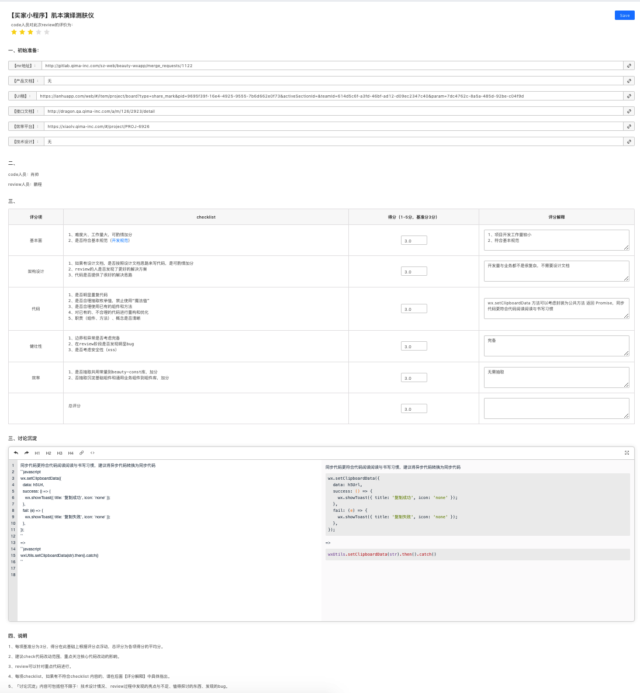

## 五、可持续保障机制

前人种树，后人除了乘凉之外得继续浇灌。流程和机制是死的，我们得用一些更加有温度的一些策略让它持续可以迭代和发展继承下去。

1. 半年度颁奖：半年我们会把半年大家的评分成绩统计出来，做一次激励，树立标杆，鼓励大家继续写出更好的代码，也继续的配合 Code Review。
2. 专人 Owner：作为一个技术项目来持续维护和收集反馈意见迭代，服务小伙伴，为团队建设助力。
3. 纳入考核：作为复杂的大型 SaaS 项目的开发者，代码能力是我们考核小伙伴专业能力的重要维度。

> 附带一些半年颁奖的图：

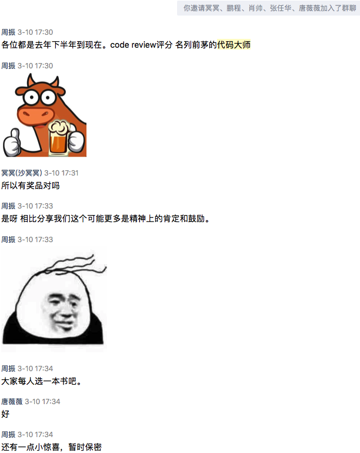

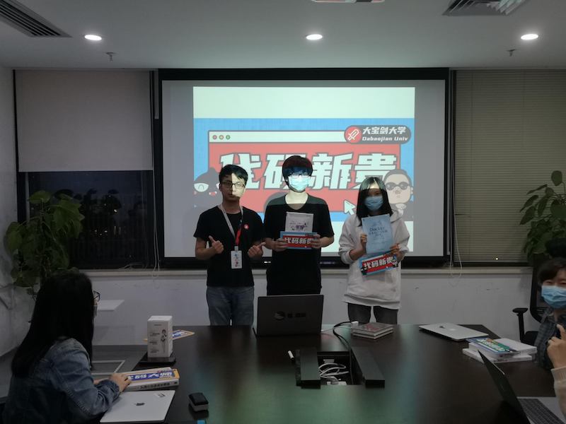
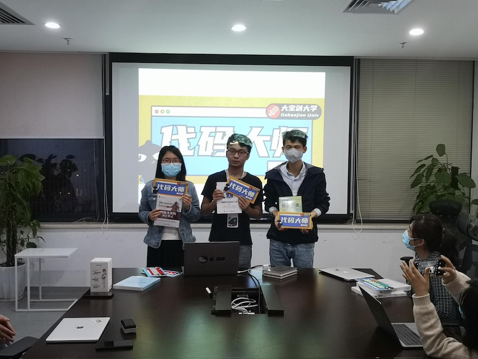
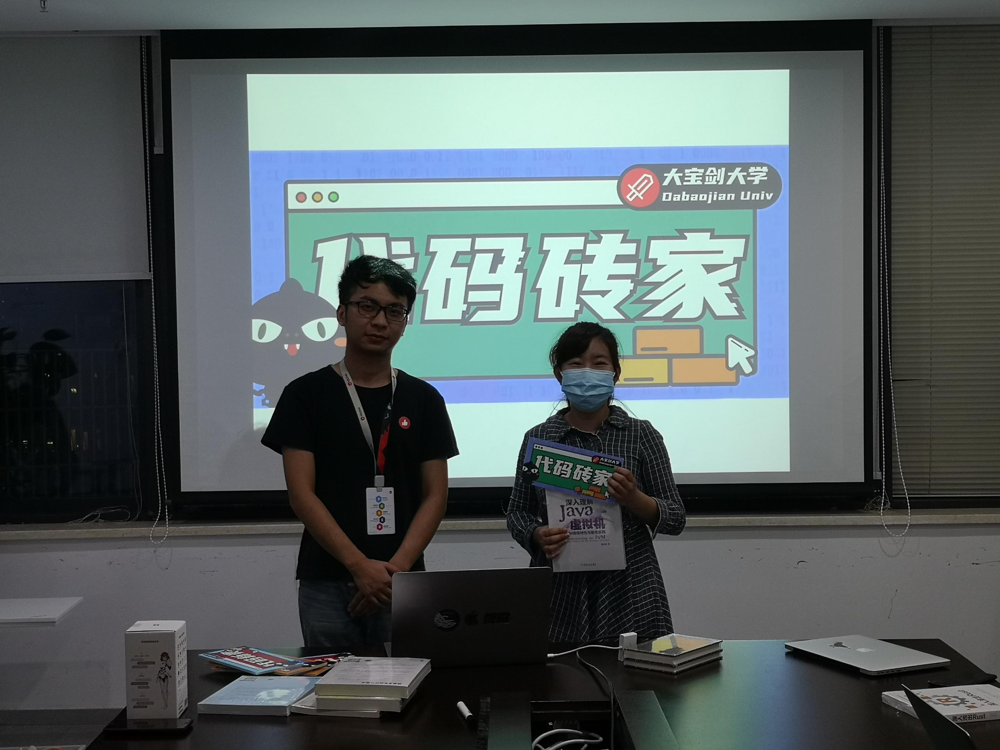
