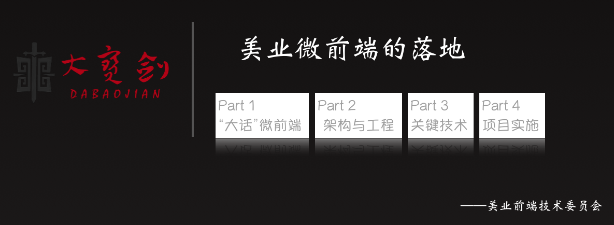

2020年，我们有赞美业的前端团队从4月起历经7个月时间，完成了美业PC架构从单体SPA到微前端架构的设计、迁移工作。PPT在去年6月份就有了，现在再整理一下形成文章分享给大家。

## Part 1 “大话”微前端
> 把这个事情的前因后果讲清楚

### 微前端是什么？

想要回答这个问题直接给一个定义其实没那么难，但是没接触过的同学未必理解。所以需要先介绍一下背景，再解释会更容易明白。

