> 2020年4月，有赞美业的前端团队历经7个月时间，完成了美业PC架构从单体SPA到微前端架构的设计、迁移工作。PPT在去年6月份就有了，现在再整理一下形成文章分享给大家。


## Part 01 “大话”微前端
> 把这个事情的前因后果讲清楚

### 微前端是什么

想要回答这个问题直接给一个定义其实没那么难，但是没接触过的同学未必理解。所以需要先介绍一下背景，再解释会更容易明白。


这张图，展示了软件开发前端后分工的三个时期：

1. 单体应用：在软件开发初期和一些小型的Web网站架构中，前端后端数据库人员存在同一个团队，大家的代码资产也在同一个物理空间，随着项目的发展，我们的代码资产发展到一定程度就被变成了巨石。
2. 前后端分离：前端和后端团队拆分，在软件架构上也有了分离，彼此依靠约定去协作，大家的生产资料开始有了物理上的隔离。
3. 微服务化：后端团队按照实际业务进行了垂直领域的拆分单一后端系统的复杂度被得到分治，后端服务之间依靠远程调用去交互。这个时候前端需要去调用后端服务时候，就需要加入一层API网关或者BFF来进行接入。

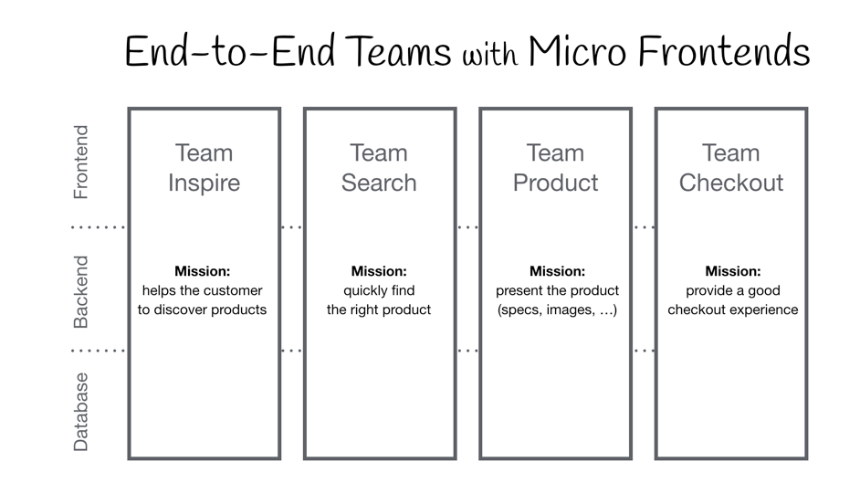

现在很多互联网公司的研发团队的工作模式更靠近这种，把整个产品拆分成多个阿米巴模式的业务小组。 
在这种研发流程和组织模式下，后端的架构已经通过微服务化形成了拆分可调整的形态，前端如果还处于单体应用模式，不谈其它，前端的架构已经给协作带来瓶颈。 
另外 Web 3.0 时代来临，前端应用越来越重，随着业务的发展迭代和项目代码的堆积，前端应用在勤劳的生产下演变成了一个庞然大物。人关注复杂度的能力有限，维度大概维持在5~8左右。单体应用聚合的生产资料太多，带来复杂性的维度太多，也容易引发更多的问题。简而言之，传统的SPA已经没办法很好的应对快速业务发展给技术底层的考验。 
我们的产品和前端项目也同样遇到了这个问题。如何解决这个问题呢？ 
其实后端的发展已经给出了可借鉴的方案，在理念上参照微服务/微内核的微前端架构应时而生。 
想要解决这个问题，在吸引力法则的指引下我们遇到了微前端架构，也验证了它的确帮助我们解决了这个难题。 

现在给出我们的微前端这样一种定义：
> 微前端是一种类似于微内核的架构，它将微服务的理念应用于浏览器端，即将 Web 应用由单体应用转变为多个小型前端应用聚合为一的应用。多个前端应用还可以独立运行、独立开发、独立部署。

### 背景


1. 美业PC作为一个单体应用经历4年迭代开发，代码量和依赖庞大，纯业务代码经统计有60多万行
2. 工程方面，构建部署的速度极慢，开发人员本地调试体验差效率低，一次简单的构建+发布需要7+8=15分钟以上
3. 代码方面，业务代码耦合严重，影响范围难以收敛，多次带来了“蝴蝶效应”式的的线上Bug和故障
4. 技术方面，通用依赖升级带来的改动和回归成本巨大，涉及例如Zent组件、中台组件等依赖包相关的日常需求和技术升级几乎不可推动
5. 测试方面，单应用应对多人和多项目发布，单应用发布总和高且非常频繁，每次的集成测试都有冲突处理和新问题暴露的风险
6. 组织方面，单应用也无法很好应对业务小组的开发组织形式，边界职责不清晰且模块开发易干扰
7. 架构方面，前端无法和后端形成对应的领域应用开发模式，不利于业务的下沉，也无法支持前端能力的服务化和对技术栈的演进依赖

总体来说，臃肿的单体应用模式，给开发人员带来了无法忍受的难处，给快速支撑业务带来了很大的瓶颈，也没有信心应对接下来的业务的继续拓展。对美业PC进行架构调整就是非常迫切和有价值的事情了

### 目标

1. 业务架构层面，围绕美业PC的业务形态、项目架构以及发展趋势，将大型多团队协同开发的前端应用视为多个独立团队所产出功能的组合。
2. 技术架构层面，解耦大型前端应用，拆分成基座应用、微前端内核、注册中心、若干独立开发部署的子系统，形成分布式体系的中心化治理系统。
3. 软件工程方面，保证渐进式迁移和改造，保证新老应用的正常运行。

### 达成价值


- 实现了前端为维度的产品的原子化，如果整合新业务，子应用可以快速被其他业务集成
- 以业务领域划分，让组织架构调整下的项目多人协作更职责清晰和成本低，且适应组织架构调整
- 减慢系统的熵增，铺平业务发展道路。


- 实现了业务子应用独立开发和部署，构建部署的等待耗时从15分钟降到了1分半
- 支持渐进式架构，系统子应用之间依赖无关，可以单个升级依赖，技术栈允许不一致，技术迭代的空间更大
- 前端能力能够服务化输出
- 架构灵活，新的业务可以在不增加现存业务开发人员认知负担的前提下，自由生长无限拓展

### 缺点
一个架构的设计其实对整体的一个权衡和取舍，除了价值和优势之外，也带来一些需要去考虑的影响。

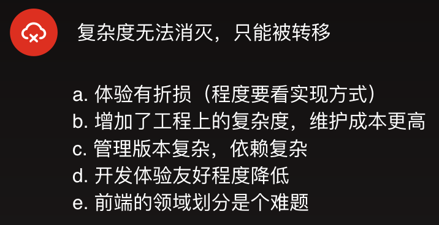


## Part 02 架构与工程 
> 从全局视角把握成果

### 微前端方案有哪些

1. 使用 HTTP 服务器反向代理到多个应用
2. 在不同的框架之上设计通讯、加载机制
3. 通过组合多个独立应用、组件来构建一个单体应用
4. 使用 iFrame 及自定义消息传递机制
5. 使用纯 Web Components 构建应用
6. 结合 Web Components 构建

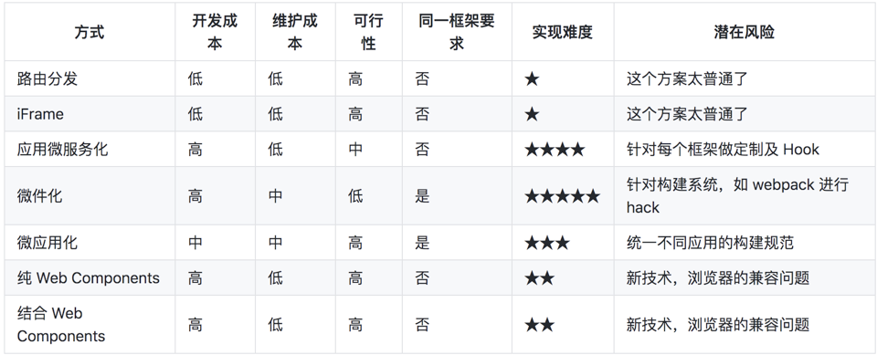

每种方案都有自己的优劣，我们兄弟团队采用了最原始的网关转发配置类似 Nginx 配置反向代理，从接入层的角度来将系统组合，但是每一次新增和调整都需要在运维层面去配置。 
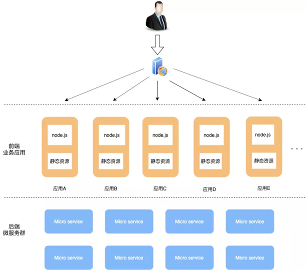
而 iframe 嵌套是最简单和最快速的方案，但是 iframe的弊端也是无法避免的。 
Web Components的方案则需要大量的改造成本。 
组合式应用路由分发方案改造成本中等且满足大部分需求，也不影响个前端子应用的体验，是当时比较先进的一种方案。

### 架构设计选型注意点
- 如何降低系统的复杂度？
- 如何保障系统的可维护性？
- 如何保障系统的可拓展性？
- 如何保障系统的可用性？
- 如何保障系统的性能？

综合评估之后我们选用了组合式应用路由分发方案，但是仍然有架构整体蓝图和工程实现需要去设计。

### 需求分析
1. 子应用独立运行/部署
2. 中心控制加载（服务发现/服务注册）
3. 子应用公用部分复用
4. 规范子应用的接入
5. 基座应用路由和容器管理
6. 建立配套基础设施

### 设计原则
1. 支持渐进式迁移，平滑过渡
2. 拆分原则统一，尝试领域划分来解耦

###  应用架构图
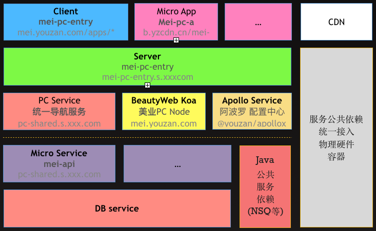

### 系统拆分
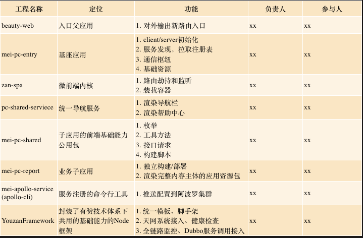

这里拆分需要说明三个点：
- 独立部署（服务注册）：上传应用资源包（打包生成文件）到Apollo配置平台，是一个点睛之笔
- 服务化和npm包插件化的区别是不需要通过父应用构建来集成，彼此依赖无关，发布独立，更加灵活/可靠
- 同时 Apollo 承载了注册中心的功能，可以省去子应用的web服务器的这一层，简化了架构

### 时序图
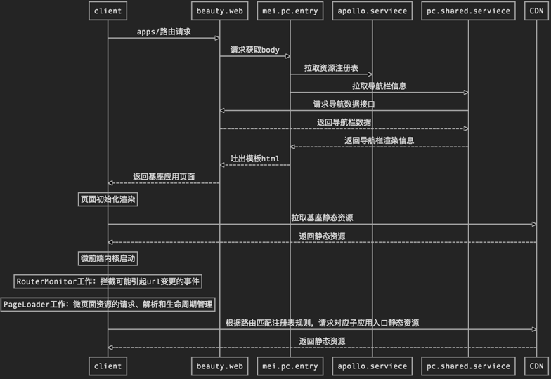

### 前端流程图
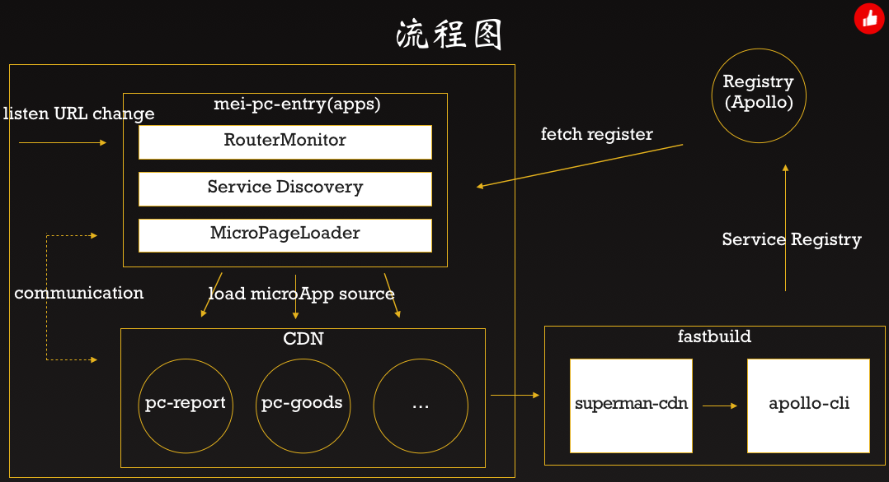
 
 ## Part 03 关键技术
 > 落地中有哪些值得一提的技术细节

### 关键技术一览
我们按项目拆分来结构化讲述，有架构核心、注册中心、子应用、代码复用四篇。 
其中包含了这些技术点：
1. Apollo
2. Apollo Cli
3. Version Manage
4. Sandbox
5. RouterMonitor
6. MicroPageLoader
7. Shared Menu
8. Shared Common

### [架构核心]消息通信

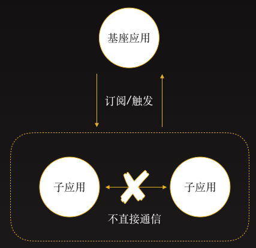

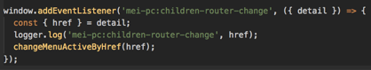

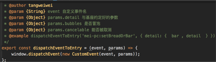

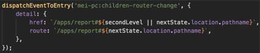

### [架构核心]路由分发
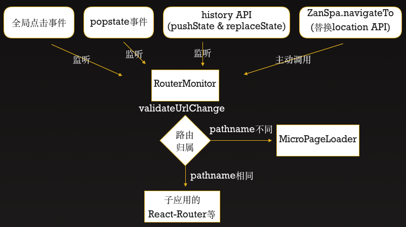

当浏览器的路径变化后，最先接受到这个变化的是基座的router，全部的路由变化由基座路由 RouterMonitor 掌管，因为它会去劫持所有引起url变化的操作，从而获取路由切换的时机。如果是`apps/xxx/#`之前的变化，只会拦截阻止浏览器再次发起网页请求不会下发，没有涉及#之前的url变化就下发到子应用，让子应用路由接管。

### [架构核心]应用隔离

主要分为 JavaScript执行环境隔离 和 CSS样式隔离。

JavaScript 执行环境隔离：每当子应用的JavaScript被加载并运行时，它的核心实际上是对全局对象 window 的修改以及一些全局事件的的改变，例如 JQuery 这个js运行之后，会在 window 上挂载一个 window.$ 对象，对于其他库 React、Vue 也不例外。为此，需要在加载和卸载每个子应用的同时，尽可能消除这种冲突和影响，最普遍的做法是采用沙箱机制 SandBox。 
沙箱机制的核心是让局部的 JavaScript 运行时，对外部对象的访问和修改处在可控的范围内，即无论内部怎么运行，都不会影响外部的对象。通常在 Node.js 端可以采用 vm 模块，而对于浏览器，则需要结合 with 关键字和 window.Proxy 对象来实现浏览器端的沙箱。

CSS 样式隔离：当基座应用、子应用同屏渲染时，就可能会有一些样式相互污染，如果要彻底隔离 CSS 污染，可以采用 CSS Module 或者命名空间的方式，给每个子应用模块以特定前缀，即可保证不会相互干扰，可以采用 webpack 的 postcss 插件，在打包时添加特定的前缀。 
对于子应用与子应用之间的CSS隔离就非常简单，在每次应用加载是，就将改应用所有的 link 和 style 内容进行标记。在应用卸载后，同步卸载页面上对应的 link 和 style 即可。

### [架构核心]核心流程图

我们把路由分发、应用隔离、应用加载、通用业务逻辑收纳到到了微前端内核的二方包中，用作各个业务线复用，在内部达成统一约定。

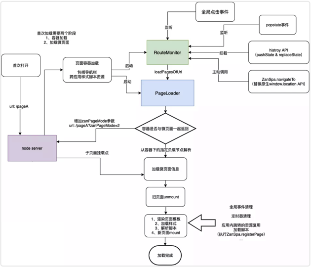

### [注册中心] Apollo

其实大部分公司在落地微前端方案的时候，并有没所谓的注册中心的概念。为什么我们的微前端也会有注册中心这个概念和实际存在呢？选型的思考点也主要来自我们后端的微服务架构。

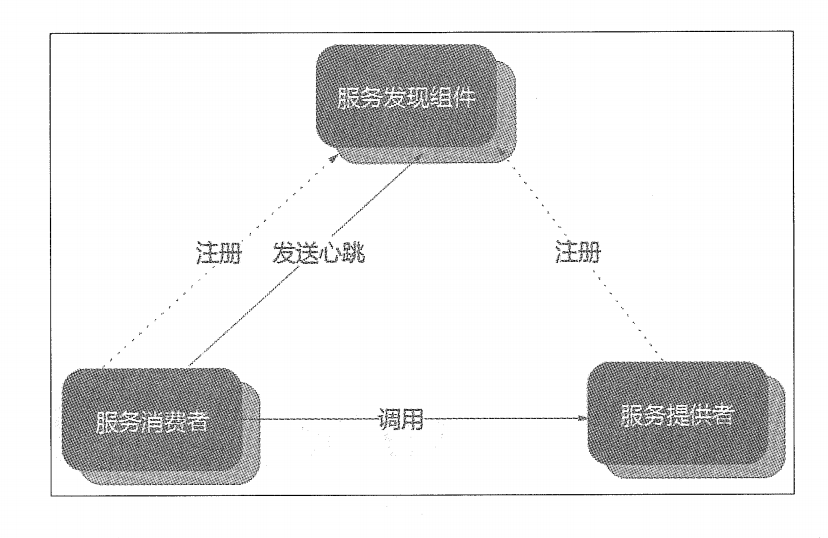

#### 为什么选择引入注册中心增加整体架构的复杂度？
两个原因：

1. 我们的子应用之间虽然不需要通信，但是也存在基座应用需要所有子应用的资源信息的情况，用来维护路由对应子应用资源地址的映射。大部分公司落地时候，都把子应用的地址信息硬编码到了基座。这样子应用增删改时候，就需要去重新部署基座应用，这违背了我们解耦的初衷。注册中心把这份映射文件从基座剥离出来了，让架构具备了更好的解耦和柔性。
2. 要知道我们的子应用的产物入口是 hash 化的上传到 CDN 的 JS 文件，同时避免子应用发布也需要发布基座应用。有两个解决方案，一种是增加子应用的 Web 服务器，可以通过固定的 HTTP 服务地址拿到最新的静态资源文件。一种就是增加注册中心，子应用发布就是推送新的 JS地址给到 注册中心，子应用的架构就可以更薄。

需要一个注册中心的话，我们也有两种方案，一种是自己自研一个专门服务于自己的微前端，虽然可以更加贴合和聚焦，但是作为注册中心，高可用的技术底层要求下的熔断降级等机制必不可少，这些研发难度大成本也高。还有一种是直接应用成熟的提供注册中心能力的开源项目或者依赖公司的已经存在的技术设施组件。

最后我们确定在选用公司内部的基础技术设施的 [Apollo](https://github.com/ctripcorp/apollo) 项目，优势有这么两方面。

1. 项目本身开源，成熟程度很高，在多环境、即时性、版本管理、灰度发布、权限管理、开放API、支持端、简单部署等功能性方面做得很不错，是一个值得信赖的高可用的配置中心。
2. 公司内部针对做了私有化定制和部署，更加适配业务，并且在 Java 和 Node 场景下都有稳定和使用，有维护人员值班。


#### 子应用的打包构建体验
1. 定位：一个子应用构建完是一个带 hash 的静态资源，等待被基座加载。
2. 怎么做：
    1. 打包一个单入口的静态资源,同时暴露全局方法给基座
    2. 每次构建生成带 hash 的入口 app.js
    3. 获取打包产出生成上传配置
    4. 根据环境参数上传到apollo
3. 体验如何
> 非常轻量，无须发布，构建即可


#### 子应用如何推送打包完成的 cdn 地址给 Apollo
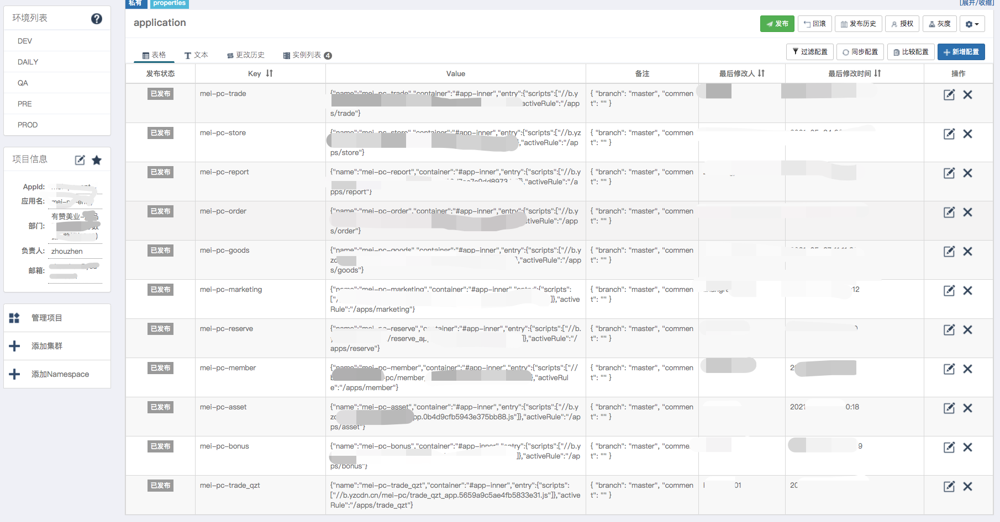
1. 获取打包完成的产物的 JSON，获取入口文件 Hash，和当前项目的基础信息。
2. 基于上述配置生成内容，然后调用 Apollo 平台开放的 API 上传到 Apollo。

#### 如何进行多环境发布及服务链协作
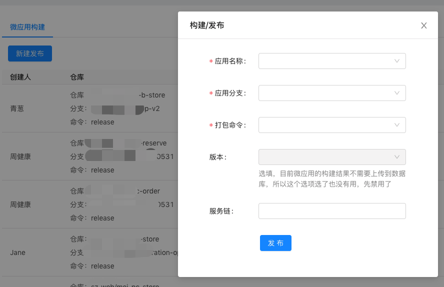
1. 环境主要分为测试、预发、生产。
2. 打包完成后，根据微前端构建平台指定环境。
3. 推送配置时候，指定 Apollo 对应的环境集群就好了。
4. 基座应用在运行时候，会根据环境与 Apollo 交互对应环境集群的注册表信息。

### [代码复用子]应用之间如何复用公共库
1、添加 shared 为远程仓库
```   
git remote add shared http://gitlab.xxx-inc.com/xxx/xxx-pc-shared.git
```
2、将 shared 添加到 report 项目中
```
git subtree add --prefix=src/shared shared master
```
3、拉取 shared 代码
```
git subtree pull --prefix=src/shared shared master
```
4、提交本地改动到 shared
```
git subtree push --prefix=src/shared shared hotfix/xxx
```
> 注：如果是新创建子应用 1-2-3-4 ；如果是去修改一个子引用 1-3-4

### [代码复用]使用shared需要注意什么
1. 修改了 shared 的组件，需要 push 改动到 shared 仓库
2. 如果一个 shared 中的组件被某个子应用频繁更新，可以考虑将这个组件从 shared 中移除，内化到子应用中 


### [子应用]子应用如何接入
首先，我们需要明白我们对子应用的定位：
> 一个子应用构建完后是一个带 hash 的静态资源，等待被基座加载，然后在中心渲染视图，同时拥有自己的子路由

第一步，根据我们的模板新建一个仓库，并置入对应子应用的代码

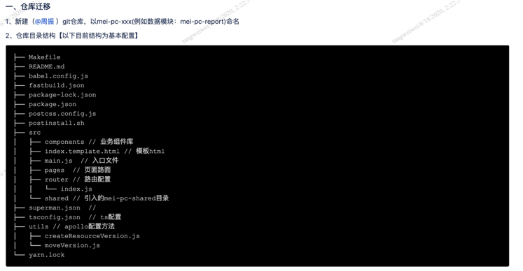

第二步，接入shared以及修改一系列配置文件

第三步，进行开发所需要的转发配置

第四部，运行，并尝试打包部署


### [子应用]子应用能独立调式吗？怎么基座应用联调？
1. 开启基座，端口和资源映射到本地再调式
2. [Zan-proxy](https://github.com/youzan/zan-proxy)
3. 本地 Nginx 转发

### [子应用]子应用开发体验


## Part 04 项目实施
> 一个问题从出现到被解决走过的曲折道路
### 1. 立项前的心路
0. 看过微前端这个概念，觉得花里胡哨，玩弄名词，强行造出新概念。
1. 对项目的目前出现的问题有个大概感知（是个问题）
2. 从业务出发利用现有知识背景思考解决手段（几乎无解）
3. 回想了解过微前端架构的概念和场景，感受到两者有契合（人生若只如初见）
4. 参考行业的解决方案印证，决定用微前端来脱掉膨胀的包袱（原来是该拆了）
5. 首先把项目在前端架构优化理了一遍，输出架构图（项目整体上探路）
6. 接下来梳理各个业务模块的依赖，看下有哪些（子应用分析）
7. 大量和不同人的聊天、了解、讨论，获取支撑技术选型的信息（外界专家）
8. 确定微前端架构在美业下的落地基本模型（架构基本）
8. 进行概要技术设计（具象化）
10. 明确迭代范围
11. 技术评审
12. 拉帮结伙/分工
13. kickoff
14. 然而故事才刚刚开始…

### 2. 参考微前端资料
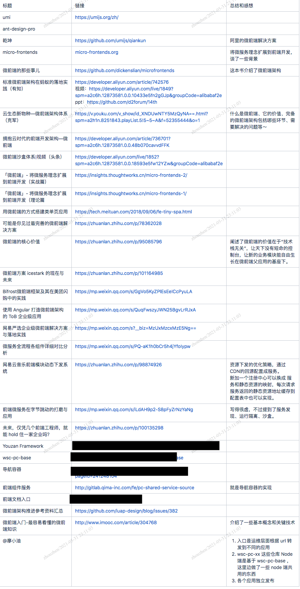

### 3. 进行PC架构优化计划
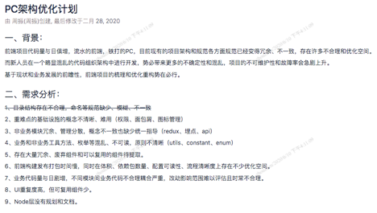

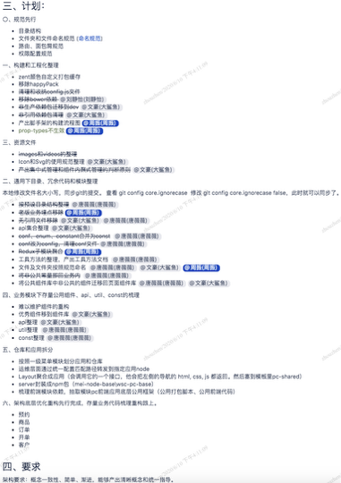

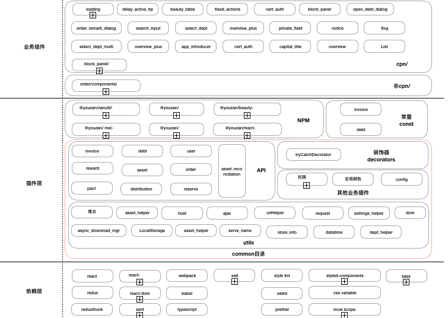

### 4. 风险
#### 预知
1. 开发人员投入度不足
2. 技术上的不确定性来更多工期风险
3. 细节的技术实现需要打磨耗时超出预期
4. 部分功能难以实现

#### 意外
1. 对项目架构理解不准确
2. 任务拆分和边界理解不到位
3. 测试人员投入不足
4. 协作摩擦

### 5. 迭代立项
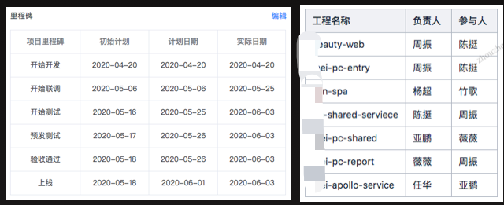

### 6.进展
1. PC微前端基座应用已上线
2. PC数据拆分成子应用已上线
3. 协调中台前端抽取了美业微前端内核
4. 通用工具方法和枚举的可视化
5. 搭配Apollo平台形成了前端子应用资源的注册中心
6. 子应用接入文档输出
7. 若干前端技术体系的优化

### 7.后续计划
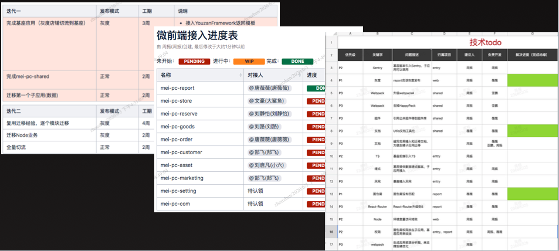