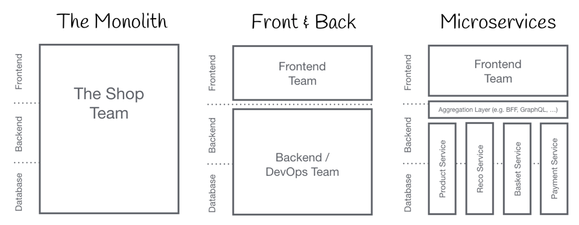

2020年，我们有赞美业的前端团队从4月起历经7个月时间，完成了美业PC架构从单体SPA到微前端架构的设计、迁移工作。PPT在去年6月份就有了，现在再整理一下形成文章分享给大家。

## Part 1 “大话”微前端
> 把这个事情的前因后果讲清楚

### 微前端是什么？

想要回答这个问题直接给一个定义其实没那么难，但是没接触过的同学未必理解。所以需要先介绍一下背景，再解释会更容易明白。

这张图，展示了软件开发前端后分工的三个时期：

1. 单体应用：在软件开发初期和一些小型的Web网站架构中，前端后端数据库人员存在同一个团队，大家的代码资产也在同一个物理空间，随着项目的发展，我们的代码资产发展到一定程度就被变成了巨石。
2. 前后端分离：前端和后端团队拆分，在软件架构上也有了分离，彼此依靠约定去协作，大家的生产资料开始有了物理上的隔离。
3. 微服务化：后端团队按照实际业务进行了垂直领域的拆分单一后端系统的复杂度被得到分治，后端服务之间依靠远程调用去交互。这个时候前端需要去调用后端服务时候，就需要加入一层API网关或者BFF来进行接入。

现在很多互联网公司的研发团队的工作模式更靠近这种，把整个产品拆分成多个阿米巴模式的业务小组。 
在这种研发流程和组织模式下，后端的架构已经通过微服务化形成了拆分可调整的形态，前端如果还处于单体应用模式，不谈其它，前端的架构已经给协作带来瓶颈。 
另外 Web 3.0 时代来临，前端应用越来越重，随着业务的发展迭代和项目代码的堆积，前端应用在勤劳的生产下演变成了一个庞然大物。人关注复杂度的能力有限，维度大概维持在5~8左右。单体应用聚合的生产资料太多，带来复杂性的维度太多，也容易引发更多的问题。简而言之，传统的SPA已经没办法很好的应对快速业务发展给技术底层的考验。 
我们的产品和前端项目也同样遇到了这个问题。如何解决这个问题呢？ 
其实后端的发展已经给出了可借鉴的方案，在理念上参照微服务/微内核的微前端架构应时而生。 
想要解决这个问题，在吸引力法则的指引下我们遇到了微前端架构，也验证了它的确帮助我们解决了这个难题。 

现在我们给出这样一种定义：
> 微前端是一种类似于微内核的架构，它将微服务的理念应用于浏览器端，即将 Web 应用由单体应用转变为多个小型前端应用聚合为一的应用。多个前端应用还可以独立运行、独立开发、独立部署。

### 背景

1. 美业PC作为一个单体应用经历4年迭代开发，代码量和依赖庞大，纯业务代码经统计有60多万行
2. 工程方面，构建部署的速度极慢，开发人员本地调试体验差效率低，一次简单的构建+发布需要7+8=15分钟以上
3. 代码方面，业务代码耦合严重，影响范围难以收敛，多次带来了“蝴蝶效应”式的的线上Bug和故障
4. 技术方面，通用依赖升级带来的改动和回归成本巨大，涉及例如Zent组件、中台组件等依赖包相关的日常需求和技术升级几乎不可推动
5. 测试方面，单应用应对多人和多项目发布，单应用发布总和高且非常频繁，每次的集成测试都有冲突处理和新问题暴露的风险
6. 组织方面，单应用也无法很好应对业务小组的开发组织形式，边界职责不清晰且模块开发易干扰
7. 架构方面，前端无法和后端形成对应的领域应用开发模式，不利于业务的下沉，也无法支持前端能力的服务化和对技术栈的演进依赖

总体来说，臃肿的单体应用模式，给开发人员带来了无法忍受的难处，给快速支撑业务带来了很大的瓶颈，也没有信心应对接下来的业务的继续拓展。对美业PC进行架构调整就是非常迫切和有价值的事情了

### 目标

1. 业务架构层面，围绕美业PC的业务形态、项目架构以及发展趋势，将大型多团队协同开发的前端应用视为多个独立团队所产出功能的组合。
2. 技术架构层面，解耦大型前端应用，拆分成基座应用、微前端内核、注册中心、若干独立开发部署的子系统，形成分布式体系的中心化治理系统。
3. 软件工程方面，保证渐进式迁移和改造，保证新老应用的正常运行。

### 价值

1. 业务价值