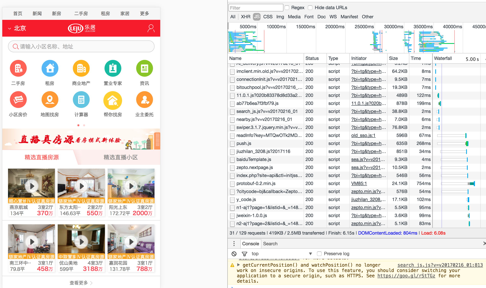

## 触屏开发

### 一 前端自动化

1. 基础库：FastClick/Zepto/Spin.js/
2. 引入ES6/Babel
3. Webpack打包，并vendor基础库
4. 小图片用Base64处理`（DataURI）`，并压入css（极大合并请求数）
5. Webpack抽离CSS
6. 前端通过hash做静态永久缓存，同时前端拿到版本控制权
7. SASS or CSS Module
8. live-server 实时开发刷新页面
9. vConsole/AlloyLever 移动真机模拟控制台
10. AlloyDesigner前端页面与设计稿对齐
11. Modernizr 用于检测用户浏览器的 HTML5 与 CSS3 特性
12. 访问 Google PageSpeed 在线评定网站来重点分析优化
13. eslint来统一风格和检查错误

### 二 前端规范化

1. 字体设置

	使用无衬线字体  
	```
	body {font-family: "Helvetica Neue", Helvetica, STHeiTi,sans-serif;
	}
	```
	
2. 基础交互

	设置全局的CSS样式，避免图中的长按弹出菜单与选中文本的行为  
	```
	a, img {
    -webkit-touch-callout: none; /* 禁止长按链接与图片弹出菜单 */
    }
	html, body {
	-webkit-user-select: none;   /* 禁止选中文本（如无文本选中需求，此为必选项） */
	user-select: none;
    }
    ```
    
3. 移动性能

	发布前必要检查项
	
	- 所有图片必须有进行过压缩  
	- 考虑适度的有损压缩，如转化为80%质量的jpg图片  
	- 考虑把大图切成多张小图，常见在banner图过大的场景
	
	加载性能优化, 达到打开足够快
	
	- 数据离线化，考虑将数据缓存在 localStorage
	- 初始请求资源数 < 4 注意！
	- 图片使用CSS Sprites 或 DataURI
	- 避免打包大型类库（vender）
	- 确保接入层已开启Gzip压缩（考虑提升Gzip级别，使用CPU开销换取加载时间） 注意！
	- 尽量使用CSS3代替图片
	- 初始首屏之外的静态资源（JS/CSS）延迟加载 注意！
	- 初始首屏之外的图片资源按需加载（判断可视区域） 注意！
	- 考虑延迟加载非首屏业务模块
	
	运行性能优化, 达到操作足够流畅
	
	- 避免 iOS 300+ms 点击延时问题 注意！
	- 缓存 DOM 选择与计算
	- 避免触发页面重绘的操作
	- Debounce连续触发的事件(scroll / resize / touchmove等)，避免高频繁触发执行 注意！
	- 尽可能使用事件代理，避免批量绑定事件
	- 使用CSS3动画代替JS动画
	- 强制使用GPU硬件加速动画
	- 避免在低端机上使用大量CSS3渐变阴影效果，可考虑降级效果来提升流畅度
	- HTML结构层级保持足够简单
	- 尽能少的使用CSS高级选择器与通配选择器

4.   

### 三 前端架构优化

> 主要针对资源请求过多和脚本管理杂乱导致首屏加载缓慢的现状
> 

1. 使用ES6模块化来规范js/css引用,按需加载部分依旧使用require
2. 非首屏图片懒加载
3. 使用`'use strict'` 更快更方便的调试
4. 异步渲染模块形成组件，js／css／模版揉合同一个目录
5. 考虑团队baiduTemplate／handlebars 选其一作为前端模板引擎
6. 文件夹命名考虑page/module/static三种类型区分类。


### 四 待加入点

* img标签图片而非background-image图片如何打成Base64到html
* 本次项目的组件模块可以供其他系统复用
* localStotage缓存静态资源


https://github.com/apeatling/web-pull-to-refresh
下拉更新
https://github.com/zhangchen2397/infiniteScrollPage
无限下拉 分页
http://developer.51cto.com/art/201505/476334.htm
https://github.com/ximan/dropload
下拉加载数据
https://github.com/WittBulter/taobaoScroller
模仿手机淘宝的上下拉加载
https://github.com/pklauzinski/jscroll
滚动加载
https://github.com/ximan/dropload
下拉加载
https://github.com/Alex-fun/vue-list
vue-list 列表滚动