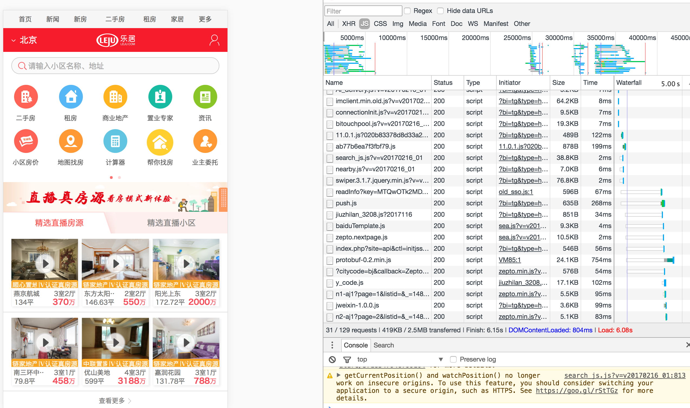

## 触屏开发规范及优化思路
原文地址：[触屏开发规范及优化思路](https://github.com/94dreamer/Note/tree/master/触屏开发规范及优化思路)（更新和修改首发）

基础搭建地址：[多页面触屏开发](https://github.com/94dreamer/touch-webpack-multiPage)

> 主要针对资源请求过多和脚本管理杂乱导致首屏加载缓慢的现状
> 

### 一 项目前端架构设想（自动化与规范化）
1. 放弃AMD/CDM模块化规范，主要使用ES6模块化来规范js/css引用,但按需加载部分依旧使用require，Webpack打包，并vendor基础库。
2. 基础库：FastClick/Flexible/JQuery(Zepto)/Template/Lazyload/Spin/
3. 考虑团队baiduTemplate／handlebars 选其一作为前端模板引擎
4. 引入ES6/Babel/Sass/PostCSS
5. Webpack利用`ExtractTextPlugin`抽离CSS
6. 小图片用Base64处理`（DataURI）`，并压入css（极大合并请求数），非首屏图片懒加载
7. 5. 异步渲染模块形成组件，js／css／模版揉合同一个目录
8. 文件夹命名考虑page/module/static三种类型区分类
9. 前端通过hash做静态永久缓存，同时前端拿到版本控制权
10. CSS Module？
11. live-server 实时开发刷新页面
12. vConsole/AlloyLever 移动真机模拟控制台
13. AlloyDesigner前端页面与设计稿对齐
14. Modernizr 用于检测用户浏览器的 HTML5 与 CSS3 特性
15. 访问 Google PageSpeed 在线评定网站来重点分析优化
16. eslint来统一风格和检查错误
17. 字体设置：使用无衬线字体
18. 基础交互：设置全局的CSS样式，避免图中的长按弹出菜单与选中文本的行为  

### 二 移动性能注意点

#### 1. 网络优化：加载性能优化, 达到打开足够快

```	
- 內联小片段样式和脚本减少网络请求	
- 域名收敛 减少请求数 
- 文本数据的优化与压缩 
- 数据接口优化与监控
- 合理安排请求顺序
- 缩短关键路径
- 权衡利弊来利用缓存（配置化）
- 减少传输体积
- 数据离线化，考虑将数据缓存在 localStorage
- 减少请求数，初始请求资源数更要尽可能减少
- 图片使用CSS Sprites 或 DataURI
- 尽量使用CSS3代替图片
- 初始首屏之外的静态资源（JS/CSS）延迟加载 注意！
- 考虑延迟加载非首屏业务模块
```	

#### 2. 性能优化： 达到操作足够流畅

```	
- 避免 iOS 300+ms 点击延时问题 注意！
- 缓存 DOM 选择与计算
- 避免触发页面重绘的操作
- Debounce连续触发的事件(scroll / resize / touchmove等)，避免高频繁触发执行 注意！
- 尽可能使用事件代理，避免批量绑定事件
- 使用CSS3动画代替JS动画
- 强制使用GPU硬件加速动画
- 避免在低端机上使用大量CSS3渐变阴影效果，可考虑降级效果来提升流畅度
- HTML结构层级保持足够简单
- 尽能少的使用CSS高级选择器与通配选择器

```


### 三 针对图片、版本控制的优化描述
#### 1. 图片资源的优化
```
- 小图片用Base64处理，并压入css（极大合并请求数）
- 非首屏之外的图片资源按需加载（判断可视区域） 注意！
- 尽量使用CSS3代替图片
- 所有图片必须有进行过压缩选择，一般来说多色彩jpg保存体积比较小，纯色系png肯定比较小，同时透明度  
- 考虑适度的有损压缩，如转化为80%质量的jpg图片  
- 考虑把大图切成多张小图，常见在banner图过大的场景
- 图片控制，合理地控制地 jpg/png的选择
- 图片体验，优化高分屏和弱网适配
```

#### 2. 基于表的静态资源版本映射系统

以前的时间戳控制版本号可以，但是不是最好的选择（如果文件名基于内容而定，而且文件名是唯一的，HTTP 报头会建议在所有可能的地方（CDN，ISP，网络设备，网页浏览器）存储一份该文件的副本。）

配合html-webpack-plugin自动引入 或者是 assets-webpack-plugin ，生成了 assets.json文件让php服务器读取脚本配置文件，吐到smarty模版变量。
> 优点

```
配置超长时间的本地缓存 —— 节省带宽，提高性能
采用内容摘要作为缓存更新依据 —— 精确的缓存控制
更资源发布路径实现非覆盖式发布 —— 平滑升级
先发静态 再发布html。
```

* php实现的关键代码是 `file_get_contents()` 函数


> 突然想到会有一个问题 assets.json放在php目录下 不能随时提交且绑定host走静态资源

解决办法：

* 服务器加个url参数 assets=dev ,或者让php服务器判断外测或者线上环境变量，读取 assets.dev.json 的配置，这份配置的脚本不带任何版本号，否则线上默认读取 assets.json。
* fidder正则匹配来代理
* 仍然没解决的问题就是 img图片的md5

### 四 待加入点

* img标签图片而非background-image图片如何打成Base64到html（现有就是尽量减少）
* 希望本次项目的组件模块可以供其他系统复用
* 资源大了之后可以考虑localStotage缓存静态资源
* 图片媒体提供多种尺寸供分辨率使用 srcset
* 组织移动核心基础库，现有的基础库不够全面、切合。

### 五 快的假象（extra）
> 除了真实手段优化代码架构和网络请求之外，仍然有一些带有"欺骗"性质的技术可以做到首页加载的优化。

#### 1. lazyload


	- 我们常说的延迟加载主要是图片延迟加载，除此之外还有一些异步交互模块也可以做到延迟异步加载。
为需要延迟的img标签设置src时留空，最好是设置一个统一的默认图，把真实URI放到data-src这类自定义的属性中。这样页面进来一开始是不会加载真实的URI资源的，除非img当时就在可视区域，否则只有当满足加载条件时，一般来说是scroll监听或者关键的dom显示隐藏操作，我们将img的src重置为自定义属性的值即可。


#### 2. fake页

我们应该避免长时间白页，所以会出现fake页的概念。在资源请求量比较大页面加载依赖js和ajax的情况下，我们可以实现一个快速展现的静态页，这一点可以参考*[手机淘宝](https://m.taobao.com/)*,在js和ajax完成之后，我们马上重新渲染整个页面，用户就会有一种秒加载的错觉。

#### 3. 预加载

预加载是在浏览器空闲的时候加载后续页面所需要资源，是一种可以提高Web体验却不怎么节约用户流量的技术手段。
> 预加载的前提是不影响主程序的情况下偷偷加载，也就是浏览器空闲。

```
浏览器的空闲难以完全掌控，我们最简单的判断标准是没有ajax存在。
1.我们需要一个code一个判断机制。
2.预加载机制如果有数量，最好是一个可停可启动的队列控制。
3.分布异步请求，保证不影响同步逻辑和主逻辑。
4.预加载依据Web业务量身定制，匹配的机制应该是本项目和本团队的私有配置。
```


